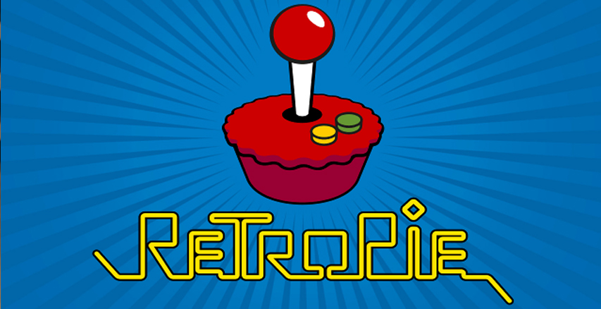
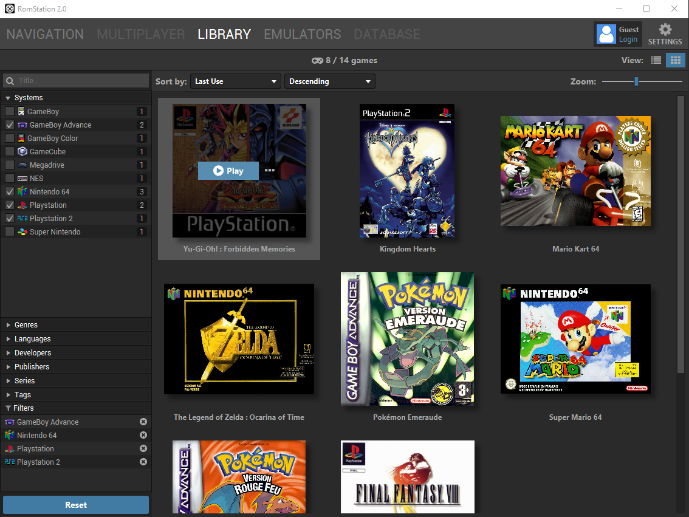
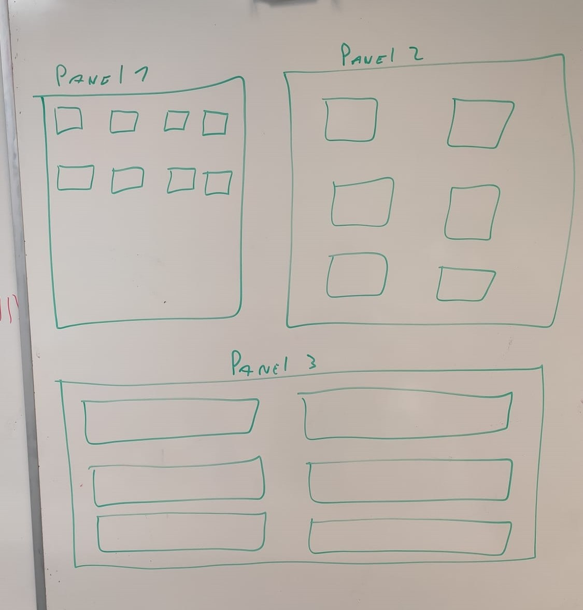

# Documentation Caiman

## Diplôme de Technicien ES en informatique

Table des matières

- [Documentation Caiman](#documentation-caiman)
  - [Diplôme de Technicien ES en informatique](#diplôme-de-technicien-es-en-informatique)
- [Résumé](#résumé)
- [Abstract](#abstract)
- [Remerciement](#remerciement)
- [Introduction](#introduction)
  - [Contexte](#contexte)
  - [Motivations](#motivations)
- [Cahier des charges](#cahier-des-charges)
  - [Spécification](#spécification)
    - [Emulateurs et contrôles](#emulateurs-et-contrôles)
    - [Création d’un compte utilisateur](#création-dun-compte-utilisateur)
    - [Interface](#interface)
    - [Paramètre graphiques](#paramètre-graphiques)
    - [Gestion des sauvegardes](#gestion-des-sauvegardes)
    - [Spécifications du “Bunker”](#spécifications-du-bunker)
    - [Spécification site web (site présent dans le Bunker)](#spécification-site-web-site-présent-dans-le-bunker)
    - [Installation](#installation)
  - [Limites du Projet](#limites-du-projet)
  - [Calendrier](#calendrier)
  - [Matériel](#matériel)
  - [Livrables](#livrables)
- [Étude d’opportunité](#étude-dopportunité)
  - [RetroPie](#retropie)
  - [RetroArch](#retroarch)
  - [RomStation](#romstation)
  - [Steam](#steam)
  - [Conclusion de l’analyse de l'existant](#conclusion-de-lanalyse-de-lexistant)
- [Analyse fonctionnelle](#analyse-fonctionnelle)
  - [Base de données](#base-de-données)
    - [Schéma](#schéma)
    - [Table categorie](#table-categorie)
    - [Table console](#table-console)
    - [Table emulator](#table-emulator)
    - [Table favoritegame](#table-favoritegame)
    - [Table file](#table-file)
    - [Table filesave](#table-filesave)
    - [Table game](#table-game)
    - [Table gamehascategorie](#table-gamehascategorie)
    - [Table rôle](#table-rôle)
    - [Table timeingame](#table-timeingame)
    - [Table user](#table-user)
    - [Table userconfigfile](#table-userconfigfile)
  - [Site web Caiman](#site-web-caiman)
    - [Création de compte](#création-de-compte)
    - [connexion](#connexion)
    - [modification des informations d’un utilisateur](#modification-des-informations-dun-utilisateur)
    - [affichage des jeux](#affichage-des-jeux)
    - [affichage d’un profil utilisateur](#affichage-dun-profil-utilisateur)
    - [ajout d’un jeu à la base de données / sur le Bunker pour le fichier .ISO](#ajout-dun-jeu-à-la-base-de-données--sur-le-bunker-pour-le-fichier-iso)
    - [modification d’un jeu](#modification-dun-jeu)
    - [Administration](#administration)
    - [Téléchargement](#téléchargement)
  - [Application  Caiman C](#application--caiman-c)
    - [Connexion](#connexion-1)
    - [Inscription](#inscription)
    - [Téléchargement de jeu](#téléchargement-de-jeu)
    - [Lancement d’un jeu](#lancement-dun-jeu)
    - [Synchronisation des sauvegarde entre le pc client et le Bunker](#synchronisation-des-sauvegarde-entre-le-pc-client-et-le-bunker)
    - [Modification de la configuration utilisateur](#modification-de-la-configuration-utilisateur)
    - [Application de la configuration utilisateur](#application-de-la-configuration-utilisateur)
    - [Gestion des manettes](#gestion-des-manettes)
  - [interface utilisateur utilisable à la manette](#interface-utilisateur-utilisable-à-la-manette)
    - [Réception des input des manettes connecté](#réception-des-input-des-manettes-connecté)
    - [Transformation des input de la manette en événement](#transformation-des-input-de-la-manette-en-événement)
    - [Structure de l’affichage](#structure-de-laffichage)
    - [Déplacement dans un panel de l’application](#déplacement-dans-un-panel-de-lapplication)
    - [Déplacement de panel en panel](#déplacement-de-panel-en-panel)
- [Analyse organique](#analyse-organique)
  - [Technologies utilisées](#technologies-utilisées)
    - [PHP](#php)
    - [C](#c)
  - [Architecture du projet](#architecture-du-projet)
  - [Description technique: Site web](#description-technique-site-web)
  - [Description technique: Application Caiman](#description-technique-application-caiman)
  - [Tests](#tests)
    - [Test de l’interface graphique](#test-de-linterface-graphique)
  - [Estimation de l’apport personnel](#estimation-de-lapport-personnel)
  - [Conclusion et perspectives](#conclusion-et-perspectives)
    - [Problème rencontrés](#problème-rencontrés)
    - [Expérience acquise durant le travail](#expérience-acquise-durant-le-travail)
    - [Amélioration envisageable](#amélioration-envisageable)
    - [Intérêt personnel](#intérêt-personnel)
- [Sources](#sources)

# Résumé

Ce document décrit le processus de conception de mon projet Caiman. Caiman est inspiré par des applications comme Retropie, RetroArch ou Steam. RetroPie est une distribution pour raspberry comprenant des émulateurs pour d'anciennes consoles de jeu. RetroArch est lui une application servant de frontend pour émulateur, RetroArch est disponible sur plusieurs plateformes(Windows, macOS, Xbox).

Caiman est un projet comprenant deux parties distinctes. La première partie consiste en un site web PHP permettant de se créer un compte et de s'identifier. Le site web permet de consulter des Informations sur les jeux présent sur sur le store ainsi que de pouvoir administrer les site et le store.

La deuxième partie du projet est un application C# inspiré par le mode Big Picture de steam. Caiman sert de frontend pour différents émulateurs (Dolphin, PCSX2,etc). L’application permet de télécharger les différents jeux qui ont été ajoutés au store prévu pour le projet. Les jeux pris en charge sont ajoutés par des administrateurs via le site internet de Caiman. L’application permet de synchroniser les sauvegardes de l’utilisateur et cela peut importe sur quel pc il lance l’application. 

# Abstract

# Remerciement

# Introduction

## Contexte

Caiman à été réalisé dans le cadre du travail de diplôme de technicien deuxième année. La réussite du travail de diplôme est l’une des conditions pour recevoir son titre de technicien en informatique.

## Motivations

Le choix de ce travail de diplôme découle de mon envie de faire un travail de diplôme qui serait intéressant, ludique et en lien avec le jeu vidéo. La réalisation d’un jeu vidéo étant trop compliquée pour un travail de diplôme, j'ai décidé de créer une application a mi-chemin entre un launcher de jeu comme Steam ou GOG et un gestionnaire de VM.

J’utilise depuis des années des émulateurs et je me heurte souvent aux mêmes problèmes, perte de sauvegarde dû à une réinstallation de windows, problème pour ripper mes jeux, téléchargement de chaque émulateur un par un. J’ai donc eu l’idée de créer Caiman pour pallier ces différents problèmes.

Un autre aspect important pour moi est la simplicité, je voulais que l'utilisation de l'application soit le plus simple possible une personne sans connaissance particulière en informatique doit pouvoir utiliser Caiman sans soucis. Une autre spécification est que l’utilisation de Caiman puisse se faire à la manette. Pour créer une interface ergonomique je me suis basé sur l’interface Big Picture de Steam qui a justement été créé pour être utilisé  a la manette.

# Cahier des charges

## Spécification

### Emulateurs et contrôles

Les différents émulateurs qui permettent d'exécuter des jeux dans Caiman sont:

*   PCSX2 (playstation 2)
*   Dolphin (gamecube / wii)

L’utilisateur doit utiliser une manette de Xbox pour utiliser Caiman à la manette (une seule manette est requise pour jouer mais plusieurs peuvent être connectées, pour jouer en multijoueurs local).

Caiman est utilisable à la manette à l'exception des formulaires. (création de compte, importation de jeux)

### Création d’un compte utilisateur

L’utilisateur a l’obligation de créer un compte pour pouvoir utiliser Caiman.

L’utilisateur peut créer un compte directement depuis Caiman s'il n’en possède pas.

### Interface

Dans l'interface, un système de catégories existe pour permettre de se retrouver plus simplement dans la liste des jeux à télécharger. Les différentes catégories sont créées par un administrateur.

Exemple de catégories:

*   jeux Mario
*   jeux Zelda
*   jeux d’aventure
*   jeux de réflexion
*   jeux multijoueur
*   jeux favoris
*   etc..

L’utilisateur peut ajouter depuis Caiman des jeux favoris pour pouvoir les retrouver plus facilement. ( une catégorie “favoris” est visible contenant les jeux favoris de l’utilisateur authentifié )

### Paramètre graphiques

L’utilisateur a la possibilité de modifier certains paramètres d’émulation:

*   La définition des jeux (définition native, proche de 1080p, proche de 4K).
*   La langue des machines.
*   Si les jeux doivent être lancés en plein écran ou non.
*   Format d’écran 16/9 ou 4/3.

### Gestion des sauvegardes

Il existe plusieurs cas où les sauvegardes de l’utilisateur se synchronisent:

1. Le joueur sauvegarde sa partie directement dans un jeu depuis Caiman. La sauvegarde que l’utilisateur vient de créer est envoyée sur le Bunker et remplace la version présente.
2. Quand le joueur lance Caiman, une vérification est faite pour savoir si une version plus récente des sauvegardes du joueur sont présentes, si c’est le cas elles sont téléchargées sur la machine du joueur.

### Spécifications du “Bunker” 

Le Bunker contient les fichiers des différents jeux au format (.ISO).

Le Bunker contient les fichiers de sauvegardes des utilisateurs. Ces sauvegardes seront envoyées de la machine de l’utilisateur vers le Bunker quand l’utilisateur sauvegarde sa partie depuis un jeu.

Les données des utilisateurs (email, jeux favoris, heures de jeux) sont stockées dans une base de données.

### Spécification site web (site présent dans le Bunker)

Sur le site web il est possible de créer un compte en spécifiant un mail et un mot de passe.

L’interface web permet de rechercher des utilisateurs pour voir leur profil.

L’affichage d’un profil permet de voir les jeux favoris d’un utilisateur ainsi que son nombre d'heures de jeu sur chaque jeu.

Le site web permet à un administrateur d’ajouter des jeux et de modifier les informations des jeux.

Le site web permet de modifier les informations de compte d’un utilisateur.

Un utilisateur peut faire la demande de réinitialiser son mot de passe.

### Installation

Caiman est téléchargeable depuis le site web. L'installateur contient les émulateurs, il n’y a donc rien à télécharger d’autre.

## Limites du Projet

Caiman sera limité au jeux que j’ai pu ajouter moi même ainsi qu’aux émulateurs que j’aurais importé, la totalité des consoles de jeux ne sera donc pas prise en charge.

## Calendrier

Le début du travail de diplôme est fixé au lundi 19 avril et le rendu est fixé au 11 juin à 12h00.

Le travail est à exécuter soit en présentiel et en télétravail du lundi au vendredi et cela 8h00 par jour.

## Matériel

*   Mon pc pour le développement
    *   Intel i7-7700 3.6 GHz
    *   32 GB de ram
    *   GTX 1060 3GB
*   Un serveur pour héberger le site et les fichiers du store
*   Une manette de Xbox Series

## Livrables

- Code source
- Planning effectif
- Planning prévisionnel
- Journal de bord
- Documentation technique
- Manuel utilisateur
- Poster
- Journal de bord
- Résumé

# Étude d’opportunité

## RetroPie

RetroPie est une distribution Linux prévue pour Raspberry et PC est un frontend pour pour jouer au jeux d’arcade, d’ancienne console et de jeu pc. Retropie est à la différence de Caiman un OS à part entière et chaque jeu doit être ajouté indépendamment par l’utilisateur sur le Rasberry/PC.

## RetroArch

RetroArch est un frontend pour émulateurs, moteur de jeu et media players. Il embarque un très grand nombre d’émulateurs et a l’avantage d'être disponible sur un très grand nombre de plateformes.

RetroArch possède des fonctionnalités très utiles comme des Shaders intégré, le jeux en réseau, le calcul du temps entre les frames, et d’autres. C’est surement le Frontend pour émulateur le plus complet disponible.

L’interface de RetroArch est inspirée par le XMB de la Playstation 3 et de la PSP ce qui le rend compatible avec une manette.

RetroArch est disponible sur:

*   Windows
*   Linux
*   Raspberry
*   Android
*   Apple macOS (ARM/x64)
*   Apple macOS/OSX
*   IOS/Apple TV
*   Xbox Series / One
*   OpenDingux
*   PSvita
*   PSP
*   PS2
*   PS3
*   PS4
*   Switch
*   WII U
*   WII
*   Gamecube
*   3DS / 2DS

## RomStation

RomStation est un frontend pour émulateur facilitant l’émulation de nombreuses consoles. RomStation a la différence de RetroPie ou RetroArch l’utilisateur a la possibilité de  télécharger les des jeux directement depuis l’application. L’application a une formule payante qui permet d’améliorer la vitesse de téléchargement des jeux. RomStation est disponible sur Windows (x64)(x86), macOS.

## Steam

Steam est une plateforme de distribution de jeux et d'applications en ligne. Steam est spécialisé dans les jeux vidéo à la différence des autres projets que j’ai cité plus haut c’est une application commercial à but lucratif.  

Steam n’est pas directement liée à l’utilisation d'émulateurs mais j’ai décidé d’en parler parce que je m’inspire de son interface créée spécifiquement pour une utilisation à la manette et la gestion que fais steam dès sauvegardes des utilisateurs. 

## Conclusion de l’analyse de l'existant

Il existe un grand nombre de frontend pour émulateur permettant de simplifier l'utilisation pour l’utilisateur mais je n’en ai pas trouvé qui essaie d’atteindre le même but que moi. Le but de Caiman est de permettre de simplifier l’utilisation d'émulateurs et de permettre de synchroniser des sauvegardes tout en fournissant la possibilité de télécharger des jeux.

Steam représente un niveau de finition dans son interface BigPicture que j’aimerais atteindre. La synchronisation des sauvegardes sur steam est peut être la plus performante si l’on compare avec d’autres boutiques comme l'Epic Game Store ou Origin.

# Analyse fonctionnelle

## Base de données

### Schéma

Le schéma suivant représente la structure de la base de données. La base de données est commune au site web et à l'application Caiman. Les tables sont principalement utilisées pour stocker les informations des utilisateurs et des différents jeux.  

### Table categorie

Cette table est utilisée pour stocker les différentes catégories auxquelles les jeux peuvent appartenir.

### Table console

Cette table sert à stocker les différentes consoles prises en charge par l'application Caiman. Chaque console doit être reliée à un émulateur.

### Table emulator

La table émulateur sert à lister les différents émulateurs disponible pour l'application Ill est possible qu' un émulateur soit compatible avec plusieurs consoles.

### Table favoritegame

Sert à lister les jeux favoris des utilisateurs.

### Table file

La table file sert à lister le nom d’un fichier ca peut etre un fichier .iso d’un jeu, un fichier de sauvegarde ou un fichier de configuration utilisateur. 

### Table filesave

Sert  faire le lien entre un jeu, un utilisateur, et un fichier de sauvegarde. Permet donc de connaître la sauvegarde d’un jeu particulier d'un utilisateur.

### Table game

Table qui liste les jeux disponibles. Chaque jeu a plusieurs informations: un nom, une description, une console. La console sert à faire savoir à l'application quel émulateur doit être utilisé. 

### Table gamehascategorie

Sert à assigner des catégorie a des jeux.

### Table rôle

Sert à lister les différents rôles (utilisateur, administrateur) ne sert que pour le site web sachant que toute la partie administration est sur le site.

### Table timeingame

Sert à stocker le temps de jeu en minutes de chaque utilisateur. Le temps de jeu est spécifique à chaque jeu.

### Table user

Cette table sert à stocker les informations de compte de chaque utilisateur de Caiman. Le compte est commun au site web et à l'application.

### Table userconfigfile

Cette table sert à faire le lien entre un fichier de configuration et un utilisateur. Le fichier de configuration sert à connaître la configuration 

## Site web Caiman

### Création de compte

L’utilisateur du site a la possibilité de créer un compte qui sera commun au site et à l'application. La création de compte nécessite de renseigner son email, de donner un nom d’utilisateur ainsi que un mot de passe.

### connexion

La connexion à son compte utilisateur permet de modifier nos informations de compte et d’ajouter ou de supprimer des jeux à la liste de favoris.

Si l’utilisateur oublie son mot de passe il a la possibilité de le réinitialiser. L’utilisateur qui décide de réinitialiser son mot de passe reçoit un mail contenant un lien de réinitialisation.

### modification des informations d’un utilisateur

Un utilisateur connecté a la possibilité de modifier ces informations:

*   mot de passe
*   liste de jeux favoris 
*   la visibilité de son profils pour les autres utilisateur

### affichage des jeux

Tous les utilisateurs ont la possibilité d’afficher la liste de jeux disponible. Il n’y a pas de restriction particulière. 

Les information disponible pour chaque jeux sont les suivant:

*   Nom
*   Description
*   Catégories du jeu

### affichage d’un profil utilisateur

Il est possible de consulter la page personnelle d'un utilisateur si celui-ci a rendu son compte publique. Les informations disponibles sont celle ci:

*   Nom d’utilisateurs
*   Jeux favoris
*   Nombres d’heures de jeux sur chaque jeux

### ajout d’un jeu à la base de données / sur le Bunker pour le fichier .ISO 

L’ajout d’un jeu se fait grâce à un formulaire, plusieurs champ sont à renseigner:

*   le nom du jeu
*   une description
*   une image
*   la console du jeu qui est uploadé
*   le nom que va porter le jeu sur le Bunker
*   le fichier de base du jeu

L’ajout à la base va créer deux entrées, une dans la table Game et une autre dans la table file. Après avoir été ajouté depuis le site web, le jeu devient accessible depuis l'application Caiman et le site web pour de la consultation.

 

### modification d’un jeu

La modification d’un ne peut être faite que par un administrateur. Les modification possible sont les suivante:

*   nom
*   description
*   console
*   catégories

### Administration

Les administrateurs ont la possibilité de faire plusieurs choses je vais donc les lister ici il n’est pas nécessaire de les détailler.

*   modifier un jeu
*   ajouter des catégories
*   ajouter ou supprimer des catégories a un jeu

### Téléchargement

L’un des intérêts du site est de pouvoir télécharger l'application Caiman. Le téléchargement de Caiman nécessite d'être authentifié sur le site. Si un invité se rend sur la page de téléchargement sans être authentifié une invitation lui sera faite de s’authentifier ou de créer un compte.

## Application  Caiman C#

### Connexion

### Inscription

### Téléchargement de jeu

### Lancement d’un jeu

### Synchronisation des sauvegarde entre le pc client et le Bunker

### Modification de la configuration utilisateur

### Application de la configuration utilisateur

### Gestion des manettes

## interface utilisateur utilisable à la manette

### Réception des input des manettes connecté

L’utilisateur de Caiman a la possibilité de pouvoir utiliser l’application au clavier souris mais aussi à la manette. Pour ce faire j’ai utilisé le paquet nuGet “SharpDX.XInput”, ce paquet me permet de connaître les manettes connecté au pc ainsi que les touches appuyées par l’utilisateur.

La seule manette qui peut se déplacer dans l'application est la manette 1. Pour connaître les boutons de la manette j’utilise la fonction getInput() qui me permet de connaître les touches qui sont pressées à un instant T.  Je vais chercher les inputs toutes les 2ms pour être sûr de ne pas louper d’inputs. 

Les inputs sont ensuite traité par l’interface de l’application qui décide quoi en faire selon le contexte.

### Transformation des input de la manette en événement 

Les input de la manette sont analysés par la form principale de Caiman selon la ou les touches qui sont pressé l’application exécute des actions différente, par exemple quand la touche “A” est pressé alors le programme envoie la touche ENTER a l'application ce qui me permet de cliquer des boutons. 

Pour gérer les événements je fais un test pour savoir si l'utilisateur utilise l’application ou non . Si l’application n’est pas focus par l’utilisateur seul une partie des actions sont possible pour éviter que des actions inattendu puisse arriver alors que l’application n’est plus visible.

### Structure de l’affichage

L’affichage est constitué d’un “XboxMainForm” il sert à contenir tous les autres panels il est aussi en charge de la gestion des inputs de la manette de l’utilisateur 1.

un “XboxMainForm” contient une liste de XboxUserController qui eux contiennent différentes choses comme des boutons des images ou des labels.

Le XboxMainForm est aussi responsable de la gestion des demandes de l'utilisateur, par exemple si l’utilisateur veut afficher l’accueil du Caiman il va lui passer un objet contenant sa demande. Il va donc traiter les demandes et afficher les panels selon les besoins de l'utilisateur.

### Déplacement dans un panel de l’application

L’application est conçue avec des “panel” c'est-à-dire une liste de listes de controls. Cette liste de controls est propre à chaque panel. Les panel contient aussi une variable position_x et position_y qui permet de connaître le controls actuellement sélectionné par l’utilisateur. Quand l’utilisateur décide de se déplacer il demande au panel de modifier sa variables x et y, mais avant de valider ce changement le panel regarde si le déplacement demandé par l’utilisateur est possible ou non.

Il existe 3 possibilités:

1. Le déplacement est possible et alors la position sur l’axe x,y est modifiée.
2. Le déplacement est impossible car il n’y a rien à l'emplacement demandé. Dans ce cas, le panel va décider de bouger le curseur sur un des emplacements possibles.
3. L’utilisateur est à la fin du panel et “sors du panel” dans ce cas il va se diriger dans un autre panel si il y en a un dans la direction demandée.

### Déplacement de panel en panel

Chaque “panel” possède un pointeur sur le panel du haut, du bas, de droite et de gauche.

Ces pointer ne sont pas forcément utilisés, ils ont le droit d'être nul.

Si l’on prend par l'exemple suivant: 

Nous avons 3 panels différents qui contiennent chacun plusieurs controls.

Le panel 1 possède donc deux pointeur différents, un sur le panel 2 et un autre sur le panel 3.

Si l’utilisateur est positionné sur le bas du panel 1 et qu’il appuie sur la touche “bas” il devrait sortir sur panel mais le panel l’en empêche mais le panel va donc vérifier si un panel n’est pas indiqué comme panel “down”. Si tel est le cas il va donc transmettre à la form principale qu’il doit changer de form “active”. Le focus va donc passer le panel 3.

Un autre cas et que l’utilisateur va peut être décider de retourner sur le panel 1 mais là un problème se pose ou doit pointer le panel haut du panel 3. Actuellement un seul panel peut être défini par côté  mais la solution est de créer de petits panel pour éviter que ces situation arrivent.

# Analyse organique

## Technologies utilisées

### PHP

### C#

## Architecture du projet

## Description technique: Site web

## Description technique: Application Caiman

## Tests

### Test de l’interface graphique

Pour pouvoir tester mon interface graphique j’ai créé un projet contenant des différentes vue pour pouvoir essayer le déplacement et et le changement de vue.

Ce programme de test m'a permis de me rendre compte des différents soucis que j’ai pu avoir et de et pouvoir les corriger avant de passer à la partie développement de l’application.

Le but de ces tests étaient de ne pas avoir à me soucier de l’interface pendant que je devais développer la gestion des jeux et des émulateurs.

## Estimation de l’apport personnel

## Conclusion et perspectives

### Problème rencontrés

### Expérience acquise durant le travail

### Amélioration envisageable

### Intérêt personnel

# Sources
