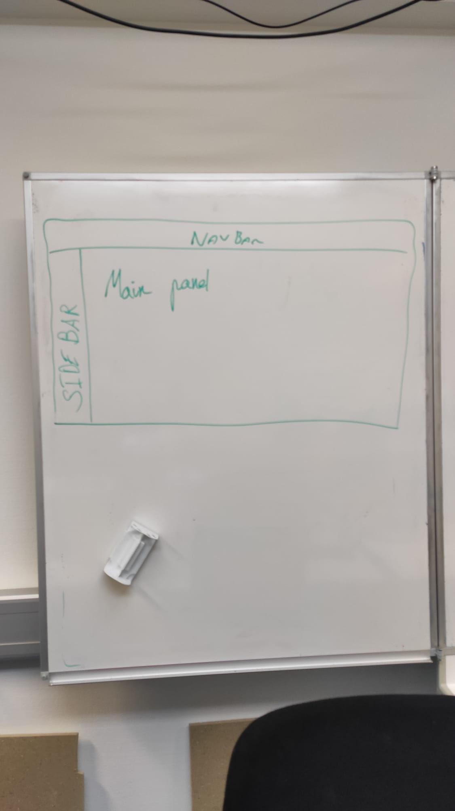
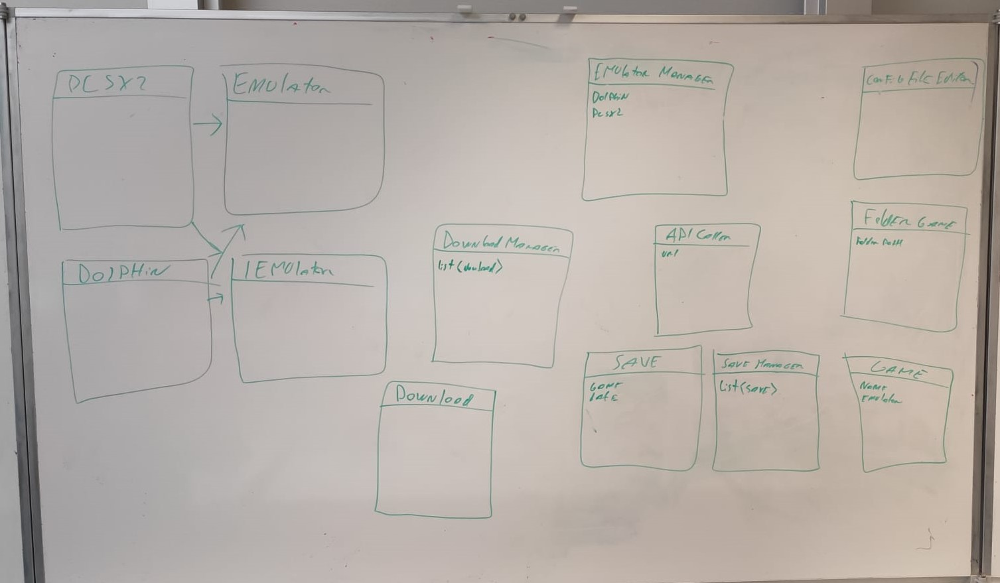

# Caiman

## 19.04.2021

### 8h05

Entretiens avec M. Garcia

### 9h05

Copie de mon disque pour Gawen

### 9h20

Création du git

### 9h30

je réfléchi à ce par quoi je vais commencer j'hésite entre commencé entre le site web ou les téléchargement

### 9h40

Modélisation de la BDD

### 10h30

Installation de laragon 

### 10h40

Création de la base de données

### 12h40

Création de la structure du site web

### 14h35

Création des différente pages et mise en place de bootstrap

### résumé

j'ai créer la base de donnée et le site web

--------

## 20.04.2021

### 8h05

je continue à créer le site web je crée les formulaires pour la connexion

### 15h20

J'ai impliqué la création de compte et la connexion, le mail doit être unique et le username aussi.

j'ai selon les indication de M. Schmid utilisé les fonctions

password_hash et password_verify de php.

### 15h30

j'ajoute des donnée a la main dans la bdd

### 15h56

aide de M.Schmid pour du sql

-----------

## 21.04.2021

### 8h10

Modification de la structure du site et ajout de l'update de mots de passe

### 13h00

l'affichage des jeux est disponible ainsi qu'une recherche sur les jeux grâce à leurs noms.

### 13h20

Ajout de champs dans la table game
- description
- imageName

### 15h00

l'affichage de la recherche et du détail d'un jeu fonctionne mais n'est pas beau.

------------

## 22.04.2021

### 8h05

Ajout de l'affichage des catégories de chaque jeu

### 9h00

Affichage des jeux qui appartiennent à une catégorie.

### 10h20

modification de l'interface de recherche

### notes personnelles

- je dois ajouter une table pour savoir le nombre d'heure de jeu de chaque utilisateurs
- je dois ajouter une gestion des messages d'erreurs.
- je peux ajouter une photo de profil
  

### 11h0

modification de l'interface de connexion et de d'inscription

### 11h50

suppression de la page de création de compte

### 12h40

Ajout d'un jeux en favoris

### 15h00

suppression d'un jeu en favoris

### a faire demain

- l'affichage des card dans le dashboard n'est pas bon

--------

## 23.04.2021

### 8h05

modification de la l'interface du Dashboard

### 8h40

Ajout d'un champ dans la table utilisateur pour spécifier si l'utilisateur est privé ou non
si l'utilisateur n'est pas privé tout le monde va pouvoir voir son profils

### 9h30

la modification du paramètre pour savoir si le compte est privé ou non

### 12h20

test de Git Hook

### 13h30

modification de l'interface theme blanc -> dark

### 15h20

Création de la page de téléchargement et mise en place de du téléchargement de Caiman depuis le site

### notes pour la prochaine fois

- Je dois créer la partie Administrateur du site
- Je dois créer un une fonctionnalité qui me permet de gérer les messages d'erreurs
- Je dois sécuriser l'accès au pages
- je dois sécuriser les différents formulaires
- je dois je dois me renseigner comment uploader des gros fichier depuis un poste clients
- je dois changer de navbar

----------

## 26.04.2021

### 8h05

notes personnelles:

- je dois ajouter la possibilité d'afficher la page d'un utilisateur
- je dois corriger mon script d'export de base de données

### 8h10

Création de la page dédiée aux administrateurs.

### 8h30 

Ajout de catégorie

### 9h00

Ajout de jeu

### notes personnels

j'ai regardé plusieurs méthodes pour envoyer un fichier depuis un formulaire en php. Pour l'instant j'utilise les fonctions de base de php et elle fonctionne donc je vais faire des tests une fois le site uploadé sur le Bunker.

### 11h00 

le fichier .iso est uploadé avec le bon nom mais pas encore dans la base de données

### 15h00

Le jeu est bien ajouté avec le bon nom ainsi que la bonne image.

### 15h45

il est maintenant possible de mettre à jour le nom, la description ou la console d'un jeu.

### 15h50

modification de la structure du git

-----

## 27.04.2021

### 8h05

ajout/ suppression de catégories a un jeu

### 9h20 

modification mineur de l'interface

### 10h05

recherche d'un profil utilisateur

### 12h15

la recherche et l'affichage d'un profil utilisateur est fonctionnel

### 13h00

modification de l'interface pour que les jeux s'affiche correctement

### 13h30

Le site est fonctionnel mais il manque des détail comme les message d'erreur et les droit sur les pages

### notes personnelles

pour finir le site il me reste les choses suivante a faire:
- Sécuriser les pages
- afficher des messages d'erreur
- suppression de catégories
- suppression de jeu
- mot de passe oublié
- commenter mon code
- pagination pour les recherches

### 13h40

documentation

------

## 28.04.2021

### 8h05

documentation

### 10h40

correction d'un bogue sur le nombre d'heure de jeu et riage des jeux par heure de jeu

### 11h00

gestion des droit d'accès au page

### 13h10

modification de la navbar

### 14h00

gestion des erreurs de du login

----------

## 29.04.2021

### 8h30

Documentation

### 10h20

Mr. Garcia m'a aidé à mettre en place ma documentation doxygen

### 11h00

documentation

---------

## 30.04.2021

### 8h05

Correction du logbook

### 8h20

supression de code inutile sur le site et mis a jour de la doccumentation

### 9h30

ajout de contrainte dans la base de données

### 10h45

Création du planning effectif

### 13h00

Configuration de debian

user tfp : FTPdiplomant
password ftp : SuperCfpt@

J’ai pus installer apache, php, et mysql mais je n’arrive pas à me connecter en ftp. A la connexion je bloque sur l’erreur : “Impossible de récupérer le contenu du dossier”. Malgré l’aide de Mr.Schmidt je n’ai toujours pas réussi.

### 15h20

Je n'arrive toujours pas a me connecter au ftp, je ne sais pas si le probléme viens de ma configuration ou du firewall

## notes pour le premier rendu

J’ai durant ces deux premières semaines, créé le site internet de Caiman. Le site n’est pas fini à 100% mais les fonctionnalités de base sont toutes implémentées. Les fonctionnalités actuelles permettent de faire toutes les choses nécessaires au fonctionnement de l'application. J’ai pris plus de temps que prévu à réaliser le site mais durant la création de mon planning prévisionnel j’ai fait des erreurs, j’ai par exemple oublié de planifier la création des fonctionnalités d’administration ( Ajout de jeux, ajout de catégories, assignation de catégories à un jeu, upload de jeux, etc ).

La documentation du site n’est pas forcément touffue mais le site n’est pas particulièrement complexe, il m’a pris du temps dû au nombre de tables à gérer. Il reste à mettre en place la récupération de mot de passe mais j’ai décidé de passer à l'interface graphique de l'application C# dès la semaine prochaine. Étant donné que le projet est la partie la plus importante de l'application, je ne vais pas configurer la récupération de mot de passe maintenant.

--------

## 03.05.2021

### 8h10

Réflexion sur l’interface graphique et création du projet

### 8h15

Importation de la classe XboxController.cs que j’ai créé précédemment. 

La table MainForm contient un XboxController() cette classe permet de connaître les manettes connectés au pc et de recevoir leur inputs.

Elle contient aussi une liste de form, ces formes sont les différentes fenêtres de l’application (si possible j’aimerai faire que seul une fenêtre soit active).

Je fais des test avec les usercontrols

### 10h00

je n’arrive pas a afficher dynamiquement quand une action est faite.

### 12h00

Mon problème venait du fait que je n’initialisait pas l 'usercontrol.

### 13h00

Je vais essayer de me baser sur la structure des div en html pour gérer le contenu de l’affichage.

### 14h00

FInalisation de la configuration du serveur

------

## 04.05.2021

### 8h05

Je continue à faire des test pour pouvoir bouger le focus d’une “div” a une autre

### 11h00

Je continue à faire des test mais j’ai apporté des modifications:

le MainForm ne contient pas une liste de list de control, ce n’est pas nécessaire sachant que le lien entre les control est seulement connu des sous contrôle

dorénavant chaque sous control possède une liste de listes de control pour pouvoir se déplacer.

quand on déplace la position maximum dans un sous control il y a deux possibilité.:
un control est disponible dans la direction souhaité
rien n’est disponible
Si un control est disponible alors la main form est informée qu'elle doit changer d’activeForm pour pouvoir se déplacer dans de bonne condition.

### 12h05

Le déplacement dans chaque form fonctionne et l’on peut passer d’une form à une autre.

-------

## 05.05.2021

### 8h05
Je continue à améliorer le fonctionnement de l’interface.

J’ai décidé de diviser l’interface en 3 “partie” 
la navbar
la sidebar
le main contenu

### 10h50

J’ai créé une nouvelle classe ButtonContext.cs, elle contient les paramètres qui doivent être passer a la forme pour quel sache l’action à exécuter.

Il est maintenant possible de cliquer sur un bouton et la manette va reprendre la ou l'utilisateur a cliqué.

### 12h40

Je permet le déplacement grâce au joystick gauche

### 13h00

J’essaie de faire en sorte que je puisse revenir en arrière dans les fenétre

### 15h00

J’ai essayé de sauver dans une liste les choses précédemment affichée mais j’ai des soucis avec les liens entre les différents panel.

Je vais essayer de recréer les anciens panel a chaque fois au lieu de les recharger.

------

## 06.05.2021

### 8h05

Je continue a faire en sorte que je puisse retourner en arrière grâce à la touche “B”

### 9h00

Il est maintenant possible de revenir en arrière dans la navigation

### 10h00

si il y a des “trou” dans la navigation le curseur le contourne

### 10h40

J’essaie d'afficher des images dans l'application  

### 13h00

J’ai discuté avec Mr Maréchal de mon git. Pour pouvoir appliquer correctement mon gitignore j’ai dus supprimer les fichier du git

### 14h00

J’ai fais des recherche sur la publication de projet et j’ai corrigé des bugs

-------

## 07.05.2021

### 8h05

J’ai essayé le paquet “Microsoft Visual Studio Installer Projects” que m’a conseillé M. Schmid. L’installation marche mais certains dossiers de PCSX2 et de Dolphin ne sont pas inclus dans l'installation. 

### 10h00

Je commente les classe que j’ai créé et je supprimer les fonctions qui ne sont pas utilisé

### 12h40

documentation + Création d’une release pour pouvoir essayer l’interface
Je déplace la documentation du projet web au projet desktop la seul documentation qui reste dans le projet web est celle qui concern son propre code (doxygen)

documentation + Création d’une release pour pouvoir essayer l’interface

Je déplace la documentation du projet web au projet desktop la seul documentation qui reste dans le projet web est celle qui concern son propre code (doxygen)

### notes personnelles
Je dois modifier la connexion a la base de données  pour passer des fonctions de cryptographie de PHP au mds. Le problème ce que je ne peux pas me connecter depuis le c# avec les fonctions de cryptographie de php.

### 15h30

J’ai mis à jour ma documentation du projet.

J’ai essayé d’ajouter des tâche à mon git mais j’ai eu des soucis pour la signature du projet donc je remet ca a plus tard.

## 10.05.2021

### 8h05

Je modifie la création de mot de passe et la connexion pour qu'un utilisateur puisse se connecter depuis le site web et Caiman.

J'utilisais les fonctions de php (password_hash et password_verify) mais je passe a du md5 + salt. La raison est que je ne pouvais pas utiliser ces fonctions pour me connecter depuis l’application c#.

### 10h10

je vais essayer de créer un login en C#

Pour ce faire, je commence par créer une classe “AccessDatabase.cs” pour communiquer avec la base. Pour stocker la la connexionString je l’ai mise dans les settings de l’application.

### 10h45

Pour pouvoir me connecter a la base de donnée je dois passer par le port 1433 mais il est fermé dans le firewall du coup je dois essayer de me connecter par le port 433

### 13h30

Je commence à créer la “vrai” interface je commence par les menu de configurations et le menu pour quitter l’application.

### 14h00 

Après une discussion avec M. Scmid j’ai décidé de faire une api.

### 14h30

J’ai demandé à M.Borel de l’aide pour la structure de mon api, il a pu m’indiquer une structure correcte mais elle est très verbeuse donc je vais surement avoir pour minimum 3 jours a faire mon API. 

--------

## 11.05.2021

### 8h00

Je continue mon api, je commence par essayer la structure de M.Borel sur une seule table pour essayer puis je vais faire les autres.

### 11h40

Je peux maintenant faire des requêtes mais j’ai un souci avec les headers.
Le hearder Autorization n’est pas correctement recu
Je pense que vu le temps que faire une API prend je fais faire en sorte que l’API ne soit que faite pour Caiman. Je vais donc seulement créer les requêtes nécessaires

### 13h00

Je vais lister les requêtes qui me seront potentiellement utile pour Caiman

liste des jeux
recherche de jeu
affichage des informations d’un jeu
recherche des informations d’un utilisateur
recherche des jeux avec un nombre qui ont été joué par un utilisateur particulier
recherche d’un jeu selon sa catégorie
jeux favoris d’un utilisateur
recherche des jeux qui ont été joué
connexion d’un utilisateur
Création de compte
réception d’un fichier de sauvegarde
réception d’un fichier de configuration

### 13h40

Je fais un test d’appel a l’API depuis Caiman

### 14h20

Pour pouvoir utiliser correctement les appels à l'api je dois utiliser des objets que je je rempli avec chaque appel.

Par exemple, si je veux recevoir les informations d’un jeu je créer un objet jeu a qui je vais attribuer les données que je viens de recevoir.

Il me faut donc créer une classe pour l'utilisateur et une classe pour les jeux.

### 15h50

je dois aussi pouvoir connaître la liste des catégories grâce à l’API

### 16h00

Il est maintenant possible de récupérer les catégories

------

## 12.05.2021

### 8h05

Documentation et suppression de code inutile

### 13h00

J’ai discuté avec M.Smid il m’a donner des conseil sur pour mon api

### 14h30

J’ai changé les routes de mon api
exemple:
/games/userFavorites/8  => /games/?byUserFavorites=8

### 15h30

J’ai essayé de mettre l’api en ligne mais quand j’arrive sur une page j’ai une erreur 500.

------

## 13.05.2021

### 11h00

L’erreur 500 que j’avais était liée à une version de PHP, le serveur avait une version de php 7.3 alors que mon API a besoin d’une version PHP minimum en 7.4.
J’ai donc mis à jour la version présente sur le serveur.

### 12h00

J’ai corrigé différentes erreurs liées à l’api par exemple quand on envoyait que le username et pas de password pour se connecter une erreur apparaissait.

### 13h00

J’ai une erreur sur le serveur quand je veux faire une requête d'utilisateur avec sa clé d’API j’ai une erreur 404.

Je vais peut etre passer la recherche d’api en POST et non en GET

## 14.05.2021

### 8h00

J’ai toujours une erreur quand je veux récupérer les informations d’un utilisateur grâce à son apitoken, l’erreur n’est présente que sur le caiman.cfpt.info.
Pour corriger l’erreur je vais passer par du post pour éviter de perdre trop de temps.

### 09h22

j’ai push sur le serveur une version de l’API qui fonctionne bien, je vais maintenant continuer ma documentation

### 09h30

je me rend compte qu j'ai une requête qui ne marche pas

### 11h30

J’ai dû modifier le .htaccess pour pouvoir appliquer les rewriteRules. Le fichier n'était pas pris en compte sur le serveur je l’ai donc mis dans le dossier ou point le virtual host.

### 12h00

documentation

------

## 17.05.2021

### 8h05

Création d’une ébauche de diagram de classe sur le tableau.

J’ai repris en grande partie le diagramme de mon POC en y ajoutant une gestion des sauvegardes et des téléchagement.

### 9h00

Création du schéma sous UMLetino

### 13h20

J’essaie de réfléchir à la manière de télécharger les sauvegardes et la façon dont je dois stocker les jeux que l’utilisateur a téléchargé.

Je pense que je vais faire en sorte de vérifier si les jeux qui devraient être présents sur le disque de l'utilisateur le sont réellement.

Je vais faire en sorte que l'utilisateur ait la possibilité de pouvoir télécharger les jeux dans un dossier spécifique. Il va devoir au premier lancement de l’application spécifier ou l'installation doit se faire. (c’est peut etre contraire a mon but de faire une application simple d’utilisation).

Je dois aussi savoir si le disque de l’utilisateur n’a pas la place requise pour télécharger le jeu demandé.

### 14h35

Discussion avec M.Maréchal 

## 18.05.2021

### 8h05

Je vais créer une page de connexion pour l'utilisateur

### 10h00

La connection marche, je vais maintenant télécharger les images des jeux

### 12h00

Je commence a faire en sorte que quand un nouveau jeu est reçu depuis l’API son image est automatiquement télécharger et mise dans le dossier %appdata% de l’application

### 13h30

J’affiche dans la sidebar le nom des catégories

### 15h00

Quand je clique sur une catégorie les jeux de la catégorie choisie sont afficher.

-----

## 19.05.2021

### 8h05

je fais en sorte d’afficher tous les jeux quand je lance l’application.

### 9h00

je vais maintenant faire en sorte de pouvoir voir les détails d’un jeu.

### 9h30

J’ai un problème avec les image bouton le clic n’est pas pris en compte

### 11h00

j’ai corriger le soucis des boutons et je modifie un petit peu l’interface

### 13h00 

je commence l'affichage des détails d’un jeu

### 14h00

 je fais des recherche sur la façon de télécharger un jeu

--------

## 20.05.2021

### 8h05

Je crée une route pour pouvoir recevoir le lien de téléchargement d’un jeu.

### 09h15

Je me rend compte que pour créer la route de téléchargement je dois:

Avoir le lien du site
Avoir le lien pour la console
avoir le nom du fichier

Pour avec ces différents éléments je dois modifier mon API pour pouvoir faire tout ça.

### 11h00

J’arrive à créer l’URL mais le fichier n’est pas accessible en dehors du serveur donc je ne sais pas vraiment quoi faire

### 12h50

Correction d’un problème où l’on pouvait se déplacer dans une case qui n’existe pas donc l’application plantait.

### 14h00

Je commence a faire en sorte que je puisse créer la route pour télécharger le fichier des jeux

------

## 21.05.2021

### 9h00

Je voulais télécharger un jeu en passant par le webClient en C# mais ma route est en POST dans mon API. Malheureusement je ne peux pas fournir de paramètres en POST avec la fonction downloadFileAsync donc je dois passer ma route en GET

### 11h00

j’ai changé ma route et j’en ai ajouté pour pouvoir connaître les dossiers ou je dois stocker les jeux et le nom du fichier d’un jeu.

### 16h00

J’ai réussi à afficher la liste des téléchargements  et maintenant  je suis en train de faire en sorte de pouvoir ajouter un jeu au favoris. j’ai réglé des soucis de droit d'accès au fichier qui sont en cours de lecture. 

