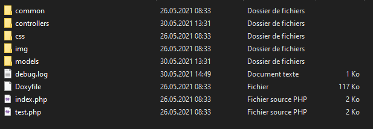

# Analyse organique

## Technologies utilisées

### HTML

### CSS

### PHP

J’ai utilisé le php pour le site web de Caiman ainsi que pour l’API.

### C#

L’application Caiman a été développé en C#, j’ai utilisé les paquets suivants:

*   Microsoft.ASPNet.WEbApi.Client
*   Newtonsoft.Json
*   SharpDX

## Architecture du projet

Le projet se divise en 3 parties: l'application Caiman pour windows, le site web et l’API. Chaque partie du projet contient une documentation doxygene qui lui est propre.

### Caiman

Je vais expliquer ci-dessous l'arborescence des fichiers de l’application Caiman et comment les émulateurs y sont intégrés. 

Je vais expliquer ce que contiennent les différents dossiers.

**Database**

Contient les classes servant à appeler la base de données.

**interfaceG**

Ce dossier contient les fichiers de base de l’affichage.

**interfaceG\usercontrol**

Ce dossier contient les différents panels qui sont utilisés dans Caiman pour créer l’affichage.

**interfaceG\XboxControl**

Ce dossier contient une version modifiée de plusieurs contrôles de base de Windows Form.

**logique**

Ce dossier contient les classes servant à gérer les émulateurs et les sauvegardes et plus généralement toute la logique de l'application.

**models**

Ce dossier contient les modèles pour simplifier l’interaction entre la base de données et Caiman.

**emulators**

Le dossier est bien présent mais n’est pas visible sur la photo. Ce dossier contient tous les fichiers des émulateurs.

### Site web

Le site web contient en plus des fichiers du site les fichiers des jeux et des sauvegardes des utilisateurs.

**games**

Ce dossier contient dans un sous dossier spécifique à chaque émulateur les fichiers des jeux.

**release**

Ce dossier contient le fichier .zip de la version téléchargeable de Caiman depuis le site.

**saves**

Ce dossier contient les fichiers de sauvegardes des utilisateurs.

**www**

Ce dossier contient les fichiers du site web de Caiman.

**common**

Ce dossier contient les fichiers de base de la vue  comme le footer ou le header.

**controllers**

Ce dossier contient les différents controllers de l’application.

**css**

contient les fichiers de css

**img**

contient les images des jeux

**models**

contient les fichiers pour simplifier l'accès à la base de données

### API

Le dossier de base de l’api contient deux dossiers importants .

#### app

**Controllers**

 Ce dossier contient les différents controllers de l’API.

**DataAccessObject**

Ce dossier contient les différents fichiers servant à exécuter des requêtes à la base de données.

**Models**

Ce dossier contient les modèles utilisés par l’API.

**System**

Ce dossier contient des fichiers servant à se connecter à la base de données.

#### public

Je ne vais pas développer davantage sur le contenu du dossier, en sachant que le détail des différents endpoint est disponible dans la documentation. Néaumoins, ce dossier comporte les points d'accès de l’API.
