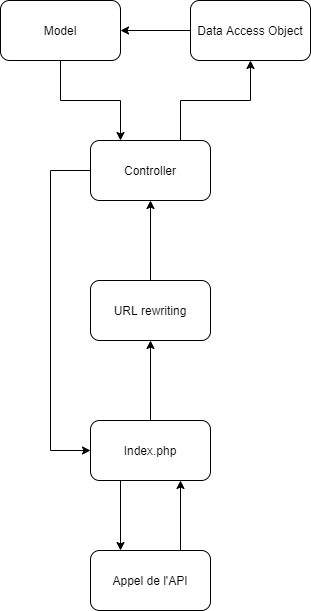

# API Caiman

L’API sert à pouvoir accéder à la base de données depuis l’application Caiman. Je vais détailler les endpoint et la structure de l’API.

## Structure de l’API

Pour expliquer la structure de l’API, je vais expliquer étape par étape comment un appel se passe.

1. L'utilisateur envoie une requête à la page index.php de api.caiman.cfpt.info.
2. La requête est réceptionnée par index.php. L’url est ensuite traité par le .htaccess pour savoir où doit envoyer à quel controller.
3. Le contrôleur décide selon les informations reçues quelle méthode il doit exécuter.
4. Le DAO est appelé et va rechercher dans la base de données les données demandé
5. Le DAO créé la réponse grâce au model.
6. La réponse est envoyée à l'utilisateur par l’intermédiaire de la page index.php

## Categories

## GET

Permet de recevoir la liste des catégories disponibles.

Les informations reçues sont les suivantes:

*   id
*   nom

## Games

## GET

Retourne la liste des jeux.

Les informations reçues sont les suivantes:

*   id
*   description
*   nom de l’image
*   id de la console
*   id du fichier du jeu

## GET(?byName)

Retourne la liste des jeux qui dans le nom contient ce que l’utilisateur a demandé.

Les informations reçues sont les suivantes:

*   id
*   description
*   nom de l’image
*   id de la console
*   id du fichier du jeu

## GET(?byCategory)

Retourne la liste des jeux qui appartiennent à une catégorie.

Il faut spécifier l’id de la catégorie qui est demandée.

Les informations reçues sont les suivantes:

*   id
*   description
*   nom de l’image
*   id de la console
*   id du fichier du jeu

## GET(?byFavoriteUser)

Retourne la liste des jeux favoris d’un utilisateur.

Il faut spécifier l’id de l’utilisateur.

Les informations reçues sont les suivantes:

*   id
*   description
*   nom de l’image
*   id de la console
*   id du fichier du jeu

## GET(?byUserTime)

Retourne la liste des jeux auxquels un joueur a joué.

Il faut spécifier l’id de l’utilisateur.

Les informations reçues sont les suivantes:

*   id
*   description
*   nom de l’image
*   id de la console
*   id du fichier du jeu
*   nombre de minutes en jeu

## GET(?gameFileName)

Retourne le nom du fichier d’un jeu.

Les informations reçues sont les suivantes:

*   filename

## GET(?gameConsole)

Retourne la console d’un jeu.

Les informations reçues sont les suivantes:

*   name
*   folderName

## GET(?idGame&apiKey)

Retourne le fichier d’un jeu.

Les informations reçues sont les suivantes:

*   fichier.iso

## GET(?idGameTime&idUser)

Retourne le temps de jeu sur un jeu. 

Les informations reçues sont les suivantes:

*   minutes

## GET(?idEmulator&idUser&apiKey)

Retourne un fichier zip contenant les sauvegardes d’un joueur pour un émulateur particulier 

Les informations reçues sont les suivantes:

*   fichier.zip

## POST(?idEmulator&idUser&apiKey)

Upload un fichier zip contenant les sauvegardes d’un joueur pour un émulateur particulier 

## POST(idGameAdd&idUser)

Ajouter un jeu en favoris pour un utilisateur particulier

## POST(idGameRemove&idUser)

Supprime un jeu en favoris pour un utilisateur particulier

## POST(idGameCheck&idUser)

Vérifie si un jeu est déjà en favoris et retourne un booléen

## POST(idGameTimeAdd&idUser)

Ajouter une minute de jeu à un jeu particulier pour un utilisateur

## Users

## GET(sans paramétres)

Retourne la liste des utilisateurs.

Les informations reçues sont les suivantes:

*   id
*   username

## POST(avec apitoken)

Retourne un utilisateur en particulier

Les informations reçues sont les suivantes:

*   id
*   username
*   password
*   salt
*   apitoken
*   caimanToken
*   email
*   idRole

## User/connection

## POST(?username, password)

Permet de vérifier les informations de connexion d’un utilisateur

Les informations reçues sont les suivantes:

*   id
*   username
*   password
*   salt
*   apitoken
*   caimanToken
*   email
*   idRole

## POST(caimanToken)

Permet de recevoir les informations d’un utilisateur grâce à un token généré à chaque connexion.

Les informations reçues sont les suivantes:

*   id
*   username
*   password
*   salt
*   apitoken
*   caimanToken
*   email
*   idRole