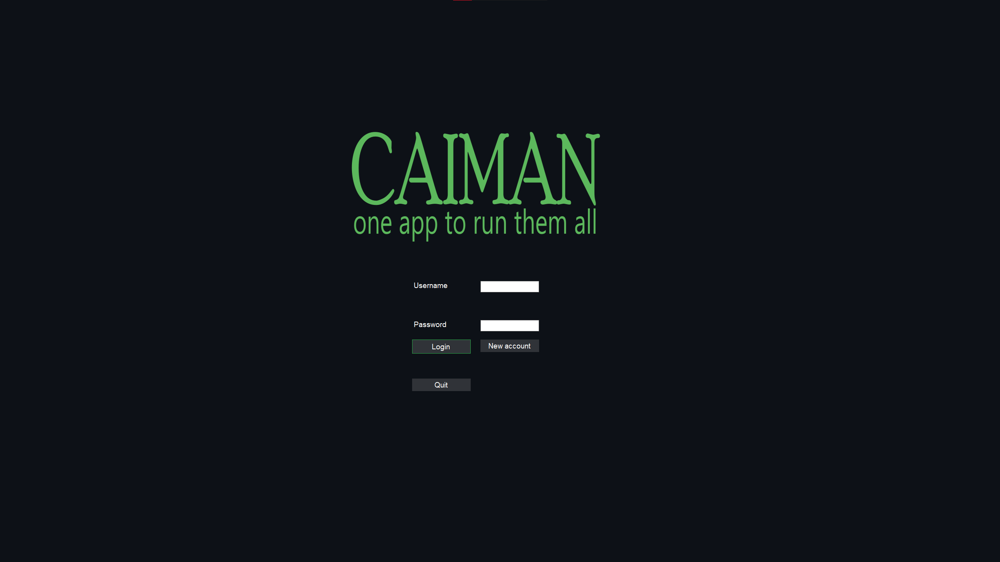
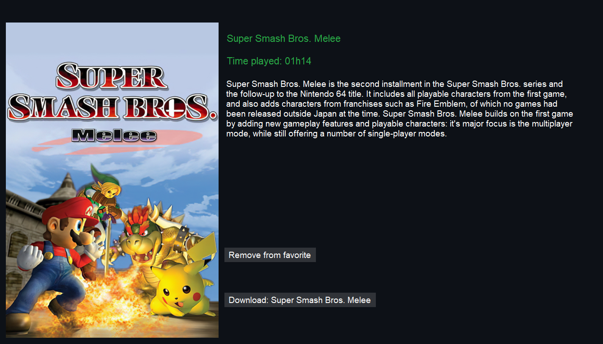
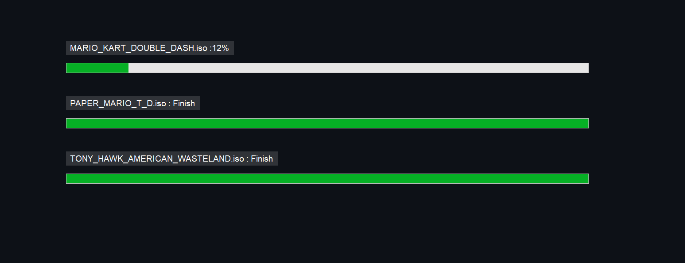
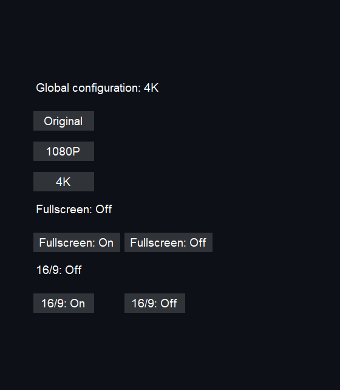
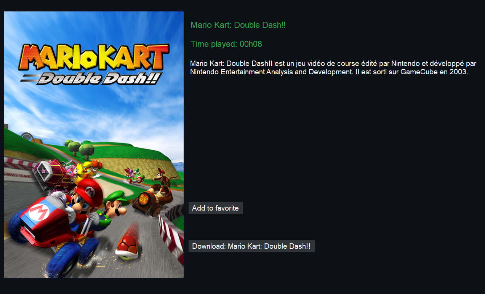
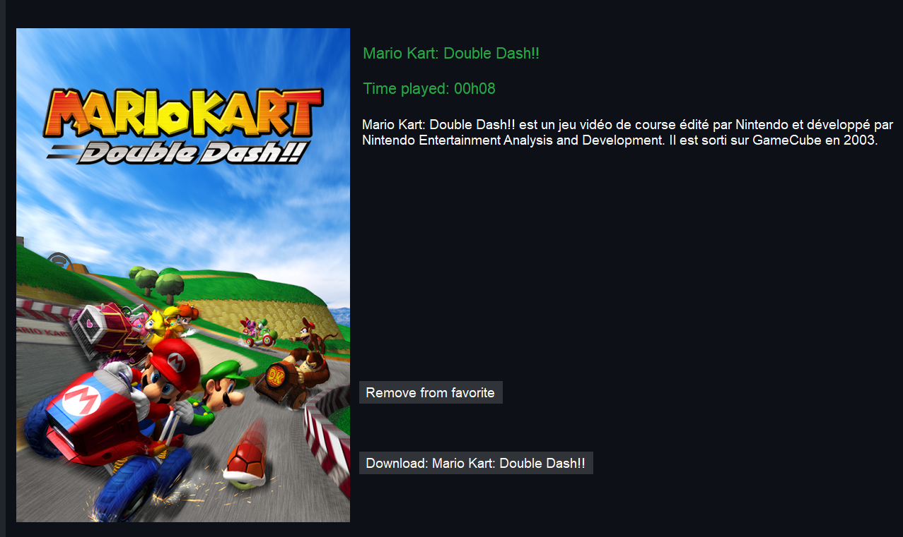
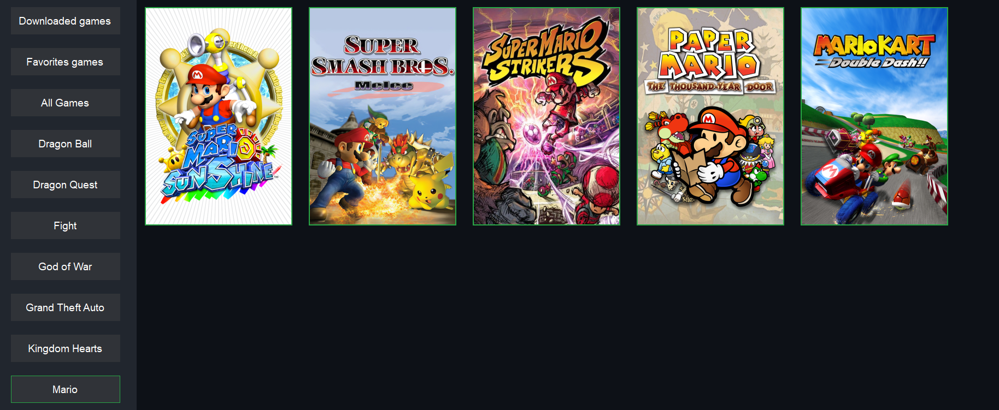
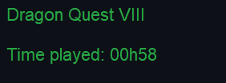

## Application  Caiman C#

### Connexion

L’utilisateur de Caiman doit obligatoirement être connecté pour pouvoir utiliser caiman. La connexion se fait avec le nom d’utilisateur et le mot de passe. Une fois la connexion valable, elle est maintenue tant que l’utilisateur ne se déconnecte pas ou tant que l’utilisateur ne s'est pas connecté sur un autre ordinateur.

### Inscription

L’inscription n’est pas disponible sur caiman mais un bouton est disponible pour être redirigé sur le site web de Caiman.

### Téléchargement de jeu

L’utilisateur a la possibilité de télécharger des jeux. Les jeux disponibles dans l’application sont ajoutés depuis le site internet de Caiman. Les téléchargements des jeux se font les un après les autres. 
 

### Lancement d’un jeu

Caiman inclut deux émulateurs Dolphin un PCSX2. Ces deux émulateurs permettent d'exécuter des jeux de Gamecube et Wii pour Dolphin et de Playstation 2 pour PCSX2. Pour lancer un jeu, il suffit de le télécharger, puis de cliquer sur Play. Il n’est donc pas nécessaire de lancer soit même un émulateur.

### Synchronisation des sauvegarde entre le pc client et le Bunker

Les sauvegardes de l’utilisateur sont synchronisées entre les différents pc qu’il utilise. La synchronisation se fait à la connexion, les sauvegardes sont stockées sur les serveurs de Caiman. La copie des sauvegardes des utilisateurs est envoyée automatiquement donc l’utilisateur n’a pas de manipulation à faire. L’envoie se passe dès que l’utilisateur sauvegarde, cela permet d’éviter de perte de sauvegardes si un problème se produit durant le moment où le joueur est en train de jouer.

### Modification de la configuration utilisateur

L’utilisateur a la possibilité de modifier plusieurs paramètres graphiques. Il a la possibilité de choisir en trois mode de configuration global:

*   Original
*   1080p
*   4K

C’est différent mode modifie l'antialiasing et la définition native de l’émulateur qui va être utilisé.

L’utilisateur a aussi la possibilité de choisir entre lancer le jeu plein écran ou non et il peut choisir si le jeu doit être en 16/9 ou en 4/3.

### Application de la configuration utilisateur

La configuration est appliquée avant de lancer un jeu, c’est à dire que la configuration n’est pas appliquée si l’utilisateur est déjà en jeu. 

### Ajout/suppresion de jeu en favoris

L’utilisateur a la possibilité de modifier ses jeux favoris directement depuis caiman.

Suppression de jeu des favoris

### Affichage de jeux par catégories

L’utilisateur a la possibilité d’afficher les jeux par catégories. Les catégories sont créées manuellement par un administrateur. Il y a certaines catégories "spéciales", par exemple les jeux favoris et les jeux uniques téléchargés par chaque utilisateur.

### Nombre d’heures de jeu

Le nombre de minutes de jeu d’un utilisateur est mis à jour à chaque minute de jeu. le nombre de minutes de jeu est visible sur la page de chaque jeu si l’utilisateur n’a pas encore joué.

### Gestion des manettes

Pour Caiman, les manettes supportées sont les manettes pour xbox qui fonctionne avec Xinput. Il est possible d’utiliser d'autres manettes pour cela, il faut passer par un programme qui va convertir les inputs de la manette non compatible en input de manette xbox.

Pour gérer les déplacements, j’utilise les touches “haut, bas, gauche,droite”, le stick gauche, la validation se fait avec la touche “A” et le retour arrière avec la touche “B”.
