# Site web Caiman

## Création de compte

L’utilisateur du site a la possibilité de créer un compte qui sera commun au site et à l'application. La création de compte nécessite de renseigner son email, de donner un nom d’utilisateur ainsi que un mot de passe.

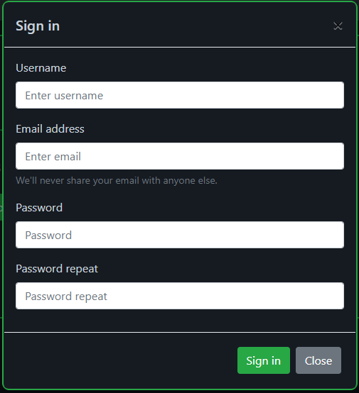

## connexion

La connexion à son compte utilisateur permet de modifier nos informations de compte et d’ajouter ou de supprimer des jeux à la liste de favoris.

Si l’utilisateur oublie son mot de passe, il a la possibilité de le réinitialiser. L’utilisateur qui se décide de réinitialiser son mot de passe reçoit un mail contenant un lien de réinitialisation.

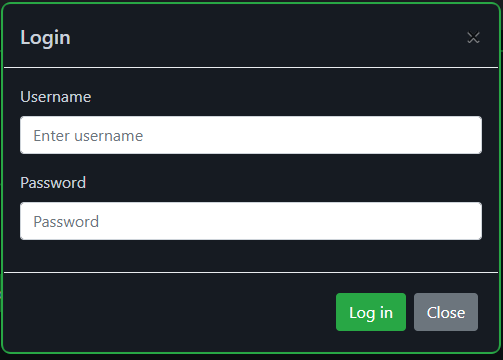

## modification des informations d’un utilisateur

Un utilisateur connecté a la possibilité de modifier ces informations:

*   mot de passe
*   liste de jeux favoris 
*   la visibilité de son profil pour les autres utilisateurs

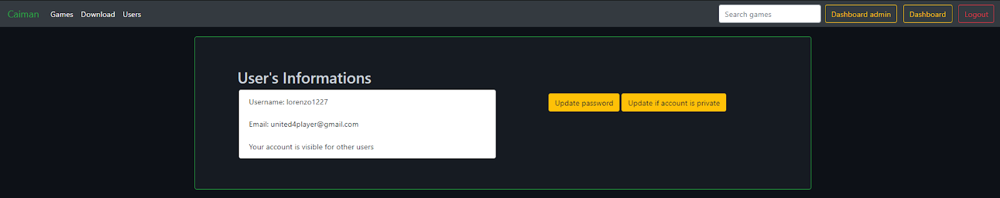

## affichage des jeux

Tous les utilisateurs ont la possibilité d’afficher la liste de jeux disponible. Il n’y a pas de restriction particulière. 

Les informations disponibles pour chaque jeu sont les suivantes:

*   Nom
*   Description
*   Catégories du jeu

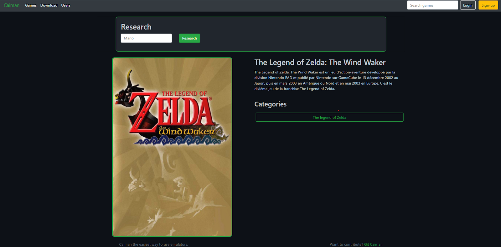

## affichage d’un profil utilisateur

Il est possible de consulter la page personnelle d'un utilisateur si celui-ci a rendu son compte publique. Les informations disponibles sont celle-ci:

*   Nom d’utilisateur
*   Jeux favoris
*   Nombres d’heures de jeux sur chaque jeu

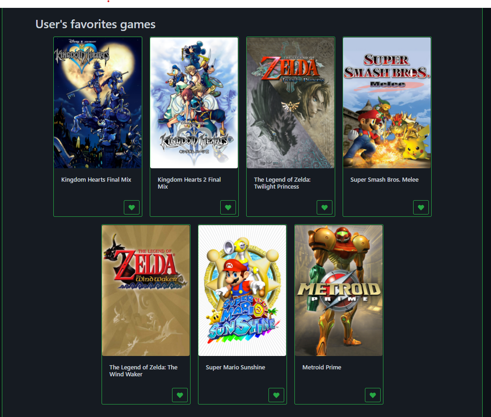

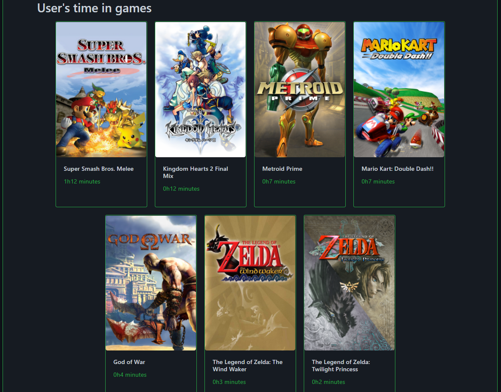

## ajout d’un jeu à la base de données / sur le Bunker pour le fichier .ISO 

L’ajout d’un jeu se fait grâce à un formulaire, plusieurs champs sont à renseigner:

*   le nom du jeu
*   une description
*   une image
*   la console du jeu qui est uploadé
*   le nom que va porter le jeu sur le Bunker
*   le fichier de base du jeu

L’ajout à la base va créer deux entrées. Une dans la table Game et une autre dans la table file. Après avoir été ajouté depuis le site web, le jeu devient accessible depuis l'application Caiman et le site web pour de la consultation.

 

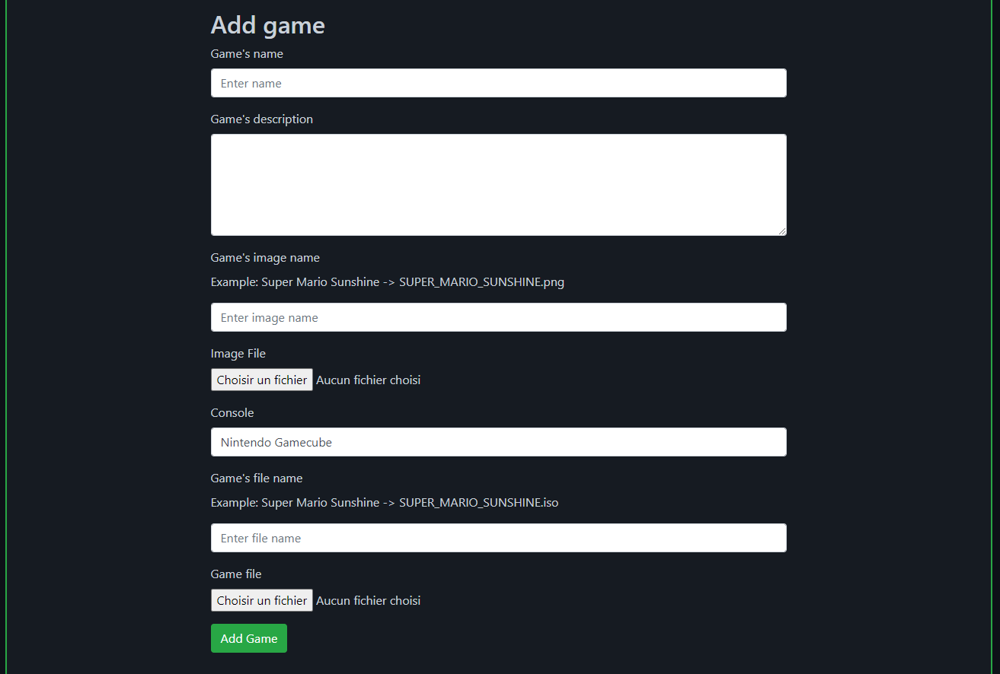

## modification d’un jeu

La modification d’un jeu ne peut être faite que par un administrateur. Les modifications possibles sont les suivantes:

*   nom
*   description
*   console
*   catégories

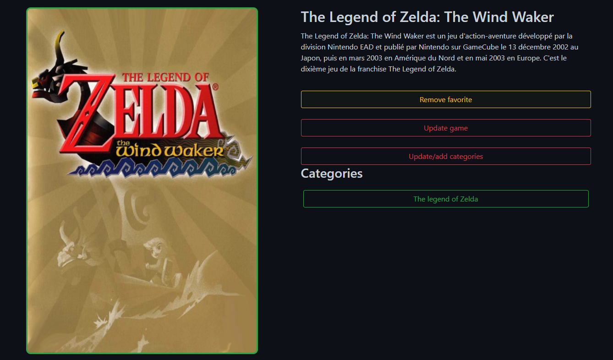

## Administration

Les administrateurs ont la possibilité de faire plusieurs choses. Donc, je vais les lister ici, il n’est pas nécessaire de les détailler.

*   modifier un jeu
*   ajouter des catégories
*   ajouter ou supprimer des catégories à un jeu

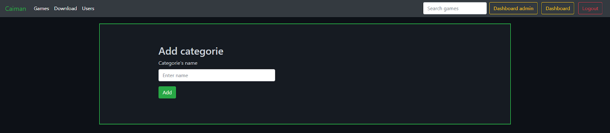

## Téléchargement

L’un des intérêts du site est de pouvoir télécharger l'application Caiman. Le téléchargement de cette application nécessite d'être authentifié sur le site. Si un invité se rend sur la page de téléchargement sans être authentifié, une invitation lui sera faite de s’authentifier ou de créer un compte.

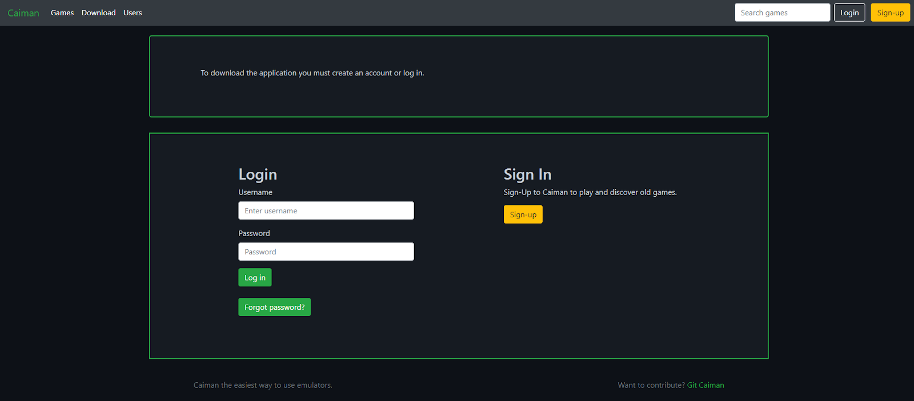

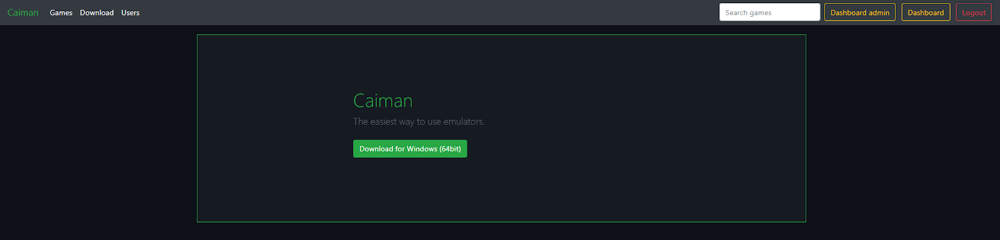

## Fonctionnalitées manquante

Malheureusement dû au temps imposé j’ai dû faire des choix organisationnel. J’ai donc décidé de me focaliser sur L’application Caiman au lieu du site internet ce qui explique que certaines fonctionnalités ne soient pas finalisées ou mises en place. Je vais lister les ce qui n’a pas été fini complètement ou abandonné.

*   Modification complète des données des jeux
*   Modification d’une catégorie
*   Réinitialisation de mot de passe
*   Création de compte administrateur