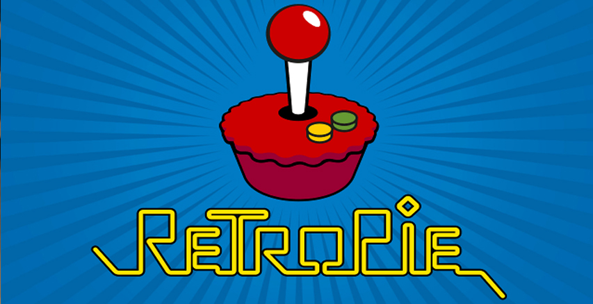
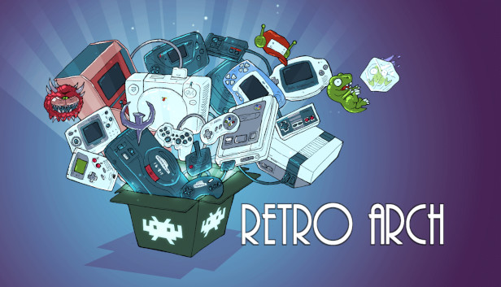
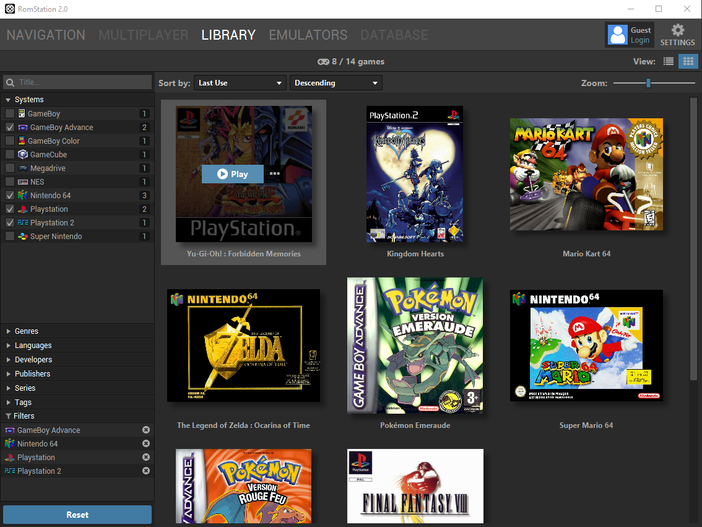
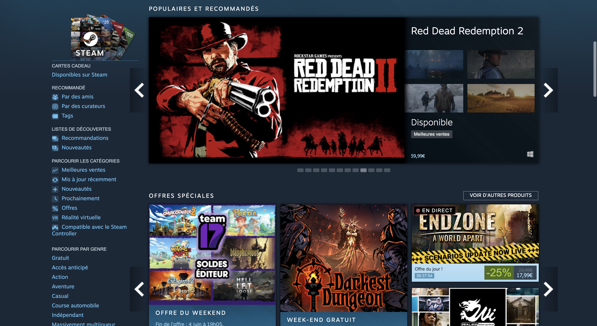

# Étude d’opportunité

## RetroPie

RetroPie est une distribution Linux prévue pour Raspberry et PC. C’est un frontend pour jouer aux jeux d’arcade, d’anciennes consoles et de jeux pc. Retropie est à la différence de Caiman un OS à part entière et chaque jeu doit être ajouté indépendamment par l’utilisateur sur le Rasberry/PC.

## RetroArch

RetroArch est un frontend pour émulateurs, moteur de jeu et media players. Il embarque un très grand nombre d’émulateurs et a l’avantage d'être disponible sur un très grand nombre de plateformes.

RetroArch possède des fonctionnalités très utiles comme des Shaders intégré, le jeux en réseau, le calcul du temps entre les frames, et d’autres. C’est surement le Frontend pour émulateur le plus complet disponible.

L’interface de RetroArch est inspirée par le XMB de la Playstation 3 et de la PSP, ce qui le rend compatible avec une manette.

RetroArch est disponible sur:

*   Windows
*   Linux
*   Raspberry
*   Android
*   Apple macOS (ARM/x64)
*   Apple macOS/OSX
*   IOS/Apple TV
*   Xbox Series / One
*   OpenDingux
*   PSvita
*   PSP
*   PS2
*   PS3
*   PS4
*   Switch
*   WII U
*   WII
*   Gamecube
*   3DS / 2DS

## RomStation

RomStation est un frontend pour émulateur facilitant l’émulation de nombreuses consoles. RomStation a la différence de RetroPie ou RetroArch, l’utilisateur a la possibilité de  télécharger des jeux directement depuis l’application. L’application a une formule payante qui permet d’améliorer la vitesse des téléchargements des jeux. RomStation est disponible sur Windows (x64)(x86), macOS.

## Steam

Steam est une plateforme de distribution de jeux et d'applications en ligne. Steam est spécialisé dans les jeux vidéo contrairement aux autres projets que j’ai cité ci-dessus. C’est une application commerciale à but lucratif.  

Steam n’est pas directement liée à l’utilisation d'émulateurs, mais j’ai décidé d’en parler car je m’inspire de son interface. Elle est créée spécifiquement pour une utilisation à la manette et la gestion que fais steam dès sauvegardes des utilisateurs. 

## Conclusion de l’analyse de l'existant

Il existe un grand nombre de frontend pour émulateur, ils permettent de simplifier l'utilisation pour l’utilisateur mais je n’en ai pas trouvé qui essaie d’atteindre le même but que moi. Le but de Caiman est de permettre la simplification de l’utilisation d'émulateurs et de permettre de synchroniser des sauvegardes tout en fournissant la possibilité de télécharger des jeux.

Steam représente un niveau de finition dans son interface BigPicture que j’aimerais atteindre. La synchronisation des sauvegardes sur steam est peut-être la plus performante, si l’on compare avec d’autres boutiques comme l'Epic Game Store ou Origin.