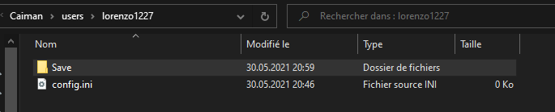

## Description technique: Application Caiman

Diagramme de classe


### Création de dossier


#### Structure des dossiers

Caiman nécessite de créer certains dossiers et fichiers pour pouvoir fonctionner correctement. Ces dossiers se trouvent dans le dossier “%appdata%\Roaming\Caiman” 


**Caiman**

Ce dossier contient les fichiers de configuration graphique, la liste des jeux téléchargés et le dernier CaimanToken reçu.

**img**

Ce dossier contient les différentes images des jeux, ces images sont téléchargées sur le site internet de caiman.

**users**

Ce dossier contient les dossiers personnels de chaque utilisateur de l'application qui s’est connecté sur le pc. Il possède les fichiers de sauvegarde de l’utilisateur en question.


#### Création des dossiers

**Dossier de base**

Les dossiers pour caiman doivent obligatoirement être créés. Donc au début du lancement de l’application Caiman, il y a toujours une vérification pour savoir si les dossiers sont bien présents. Si c’est le premier lancement de Caiman ou si les dossiers ont été supprimés, ils vont être créés.

````CODE````

**Dossier des utilisateurs**

La création des dossiers des utilisateurs pour gérer correctement les sauvegardes. Ces dossiers sont créés à la première connexion de l’utilisateur.

````CODE````


### Verification des jeux présent sur le disque

Pour connaître les jeux qui ont été téléchargés, il existe un fichier comprenant les ids des jeux. Ce fichier se trouve dans le dossier “appdata” de Caiman. Il est donc commun à tous les utilisateurs. Ce fichier est mis à jour quand un utilisateur a fini de télécharger un jeu ou quand il décide d’en supprimer un.

`````CODE````

Si l’utilisateur décide de supprimer un fichier sans passer par caiman il pourrait y avoir un souci alors pour pallier à ce problème une vérification est faite. Au lancement de l’application, si un fichier est manquant, alors le fichier qui contient les id des jeux sera mis à jour.

````CODE````


### Paramètres graphique


#### Liste des paramètres graphique

L’utilisateur a la possibilité de modifier plusieurs paramètres:

La configuration global de l’émulateur


*   Original
*   1080p
*   4K

Si le jeu doit se lancer en mode plein écran


*   true
*   false

Si le jeu doit se lancer en 16/9


*   true
*   false

Les différents modes graphiques modifient ces paramètres:


*   le filtrage anisotropique
*   l’upscale de la définition

Le filtrage anisotropique permet entre autres de diminuer l'effet de crénelage, ainsi qu’à améliorer l’affichage des textures vue depuis un angle de vue extrême.

L’upscale de la définition permet d'augmenter la définition native du rendu. Par exemple, la définition de base de la Playstation 2 sur le jeu Kingdom Heart( 512x448). Cette définition est donc la définition que l’utilisateur va avoir en “Original”, mais s’il opte pour le paramètre 1080p, il va avoir une définition native de 1536x1344. En mode 4K le rendu sera en définition 4096x3584.


#### Fichiers de configuration PCSX2

Pour l'émulateur PCSX2, il y a deux fichiers de configuration qui doivent être modifiés.

Les fichiers se trouvent dans le dossier “PCSX2\inis\”.

Le fichier “GSDX.ini” permet de modifier les paramètres de d’upscale et de filtrage anisotropique.

Le fichier “PCSX2_ui.ini” permet de modifier l’affichage en plein écran et le format d’affichage.

Le paramètre de format d’écran dans le fichier de configuration de PCSX n’est pas un booléen mais du texte je dois avant l'écriture dans le fichier le convertir.

````CODE````

Pareil pour le paramètre de mode plein écran 

````CODE````


#### Fichiers de configuration Dolphin

Pour l'émulateur Dolphin, il y a deux fichiers de configuration qui doivent être modifiés.

Les fichiers se trouvent dans le dossier “Dolphin\User\Config\”.

Le fichier “GFX.ini” permet de modifier les paramètres de d’upscale et de filtrage anisotropique.

Le fichier “Dolphin.ini” permet de modifier l’affichage en plein écran et le format d’affichage.

Le paramètre de format d’écran dans le fichier de configuration de Dolphin n’est pas un booléen mais un nombre. Donc avant l'écriture dans le fichier je dois le convertir.

````CODE````


#### Sauvegarde des paramètres graphique

Les paramètres graphiques définis par l’utilisateur se trouvent dans le dossier “appdata\Caiman\Caiman\config.ini”.

Les paramètres sont mis à jour grâce à la classe ConfigFileEditor, cette classe permet la manipulation de fichier “.ini” que ce soit la lecture,la modification, la suppression, la création de propriétés.

````CODE````


### Téléchargement d’images

Le téléchargement des images se fait à la création d’un objet de type Game. Le téléchargement se fait à partir du site web de Caiman “caiman.cfpt.info”. Les fichiers sont téléchargés dans le dossier appdata. L'intérêt de stocker les images dans ce dossier est de créer un système de cache qui sera accessible à tous les utilisateurs.  \
 \
Le téléchargement se fait grâce à un WebClient. Avant tout téléchargement de fichier, Caiman vérifie si le fichier n’est pas déjà existant, ce qui permet d'éviter de télécharger plusieurs fois la même image.

````CODE````


### Exécution de jeu


#### Choix du jeu à lancer

Le choix du jeu se fait à partir de la page de visualisation des détails d’un jeu. Quand l’utilisateur clique sur le bouton “Play” l’id du jeu qui doit être exécuté est envoyé à la fonction EmulatorManager.StartGame(idGame).

La fonction va ensuite faire un appel à l'API pour connaître de quelle console est le jeu qui doit être exécuté et selon la console un émulateur différent sera utilisé.


#### Emulateur embarqué avec Caiman

Caiman embarque deux émulateurs PCSX2 et Dolphin ces émulateurs servent respectivement à l'exécution de jeux de Playstation 2 et de Gamecube/Wii. L'exécution n’est pas la même selon l’émulateur, alors je vais détailler pour chacun. Avant l'exécution d’un jeu, l'application des paramètres graphiques est faite mais je ne vais pas le détailler ici.


#### Exécution avec PCSX2

En premier lieu, je vais recréer le chemin qui mène au fichier qui doit être exécuté par exemple “C:\Caiman\Playstation2\DRAGON_QUEST_VIII.iso”. Par la suite, je vais créer une variable pour les différents paramètres, dans la version de caiman actuel on ne peut pas changer ces paramètres se sera donc toujours “ --nogui --portable”.

Le premier paramètre fait en sorte que l’émulateur n’affiche pas d’interface graphique, seule la fenêtre d'exécution du jeu est visible. Le deuxième paramètre sert à dire à PCSX2 que les fichiers de configurations qui doivent être utilisés sont ceux du dossier de l’émulateur, et non ceux du dossier créé pour chaque utilisateur windows par PCSX2.

Pour lancer l'exécution, je vais lancer le processus de PCSX2.exe avec en premier paramètre le chemin de l’iso à exécuter et après les paramètres cités précédemment.

````CODE````


#### Exécution avec Dolphin

Ensuite, je vais recréer le chemin qui mène au fichier qui doit être exécuté par exemple “C:\Caiman\GamecubeWii\METROID_PRIME.iso”. Je vais également créer une variable pour les différents paramètres, dans la version de caiman actuel on ne peut pas changer ces paramètres, il sera toujours “ --batch”.

Le paramètre “--batch” fait en sorte de ne pas afficher l’interface de Dolphin, et donc d’avoir seulement la fenêtre d'exécution du jeu.

Pour lancer l'exécution, je vais lancer le processus de PCSX2.exe avec en premier paramètre le chemin de l’iso a exécuter et après le paramètre cité précédemment.

````CODE````


#### Information complémentaire 

Il n'est pas possible de lancer un jeu alors qu' un autre est toujours en cours.


### Affichage et calcul du temps de jeu

Le temps de jeu est comptabilisé dans la base de données à la minute près.


#### Affichage dans le détail d’un jeu

Quand un utilisateur de Caiman se rend sur la page de détails d’un jeu, il verra son nombre d’heures et de minutes de jeu. Pour récupérer cette information, je fais un appel àla base de données CallAPI.CallTimeInGameUser(idGame,idUser) cette appel va me rendre un objet TimeInGame qui va permettre de formater la réponse de l’API et afficher les heures et le minutes sous le format “10h10”. Si l’utilisateur n’a pas jouer au jeu, il verra afficher “Time played: 00h00”.

````CODE````


#### Affichage du temps de jeu actuel

Quand un utilisateur lance un jeu, un objet GameTimer va être créé, cet objet sert à compter le temps de jeu de la session actuelle et à mettre à jour la base de données.

La classe GameTimer va initialiser in timer pour rafraîchir l’affichage de la navbar avec la valeur adéquate. Ce timer se rafraîchit toutes les secondes. Celui-ci va également appeler la fonction UpdateTimer, UpdateTimer va incrémenter le nombre de secondes de jeu et toutes les 60 secondes, il va faire un appel à l'API pour incrémenter le temps de jeu de l’utilisateur dans la base de données. L'incrémentation se fait donc toutes les minutes, cela permet d'être assez précis dans le décompte de temps de jeu.

````CODE````

L’affichage de temps de jeu se fait dans la navbar en haut à gauche, Les informations affichées sont les suivantes:


*   Nom du jeu en cours
*   heures et minutes de jeu de la session actuel sous le format 10m50 


### Téléchargement de jeux


#### Type de fichiers 

Les fichiers utilisés par les émulateurs sont des fichiers .iso, que ce soit par PCSX2 ou Dolphin.


#### Choix du fichier à télécharger

Le fichier à télécharger se fait sur la page de détails d’un jeu, si le jeu n’a pas déjà été téléchargé. Un bouton “download” sera présent, ce bouton va envoyer l’id du jeu qui doit être télécharger.

```` CODE ```` 


#### Ajout d’un jeu à la liste de téléchargement

Les téléchargement des jeux sont gérés par la classe “DownloadManager”, cette classe contient 3 listes de téléchargement différentes:


*   lst_download
*   lst_activeDownload
*   lst_finishDownload

La première contient les téléchargement en attente, la deuxième le téléchargement en cours et la troisième la liste des téléchargements terminés.

Quand un téléchargement est créé, il est automatiquement ajouté à la liste de téléchargement en attente.


#### Lancement d’un téléchargement 

À l’ajout d’un téléchargement, la fonction StartDownload() est appelée. Cette fonction vérifie si dans la liste de téléchargement il sera lancé. Si aucun téléchargement n’est en cours, la fonction NextDownload() va être lancée.

La fonction NextDownload() sert à savoir si un téléchargement est en cours,Si un téléchargement est en cours, il sera déplacé dans la liste des téléchargements finis, si aucun téléchargement n’est en cours le premier téléchargement de la liste en attente est lancé


#### Téléchargement d’un fichier 

Quand la fonction download.StartDownload() est lancée, le WebClient se lance également. Ce WebClient télécharge le fichier en appelant l’API de caiman en passant en paramètres l’id du jeu qui doit être télécharger et l’apiKey de l’utilisateur.

```` CODE ````

Le fichier sera téléchargé dans le dossier spécifique à l'émulateur, par exemple si un jeu pour l’émulateur PCSX2 est téléchargé alors le jeu sera télécharger dans le dossier

“C:\Caiman\Playstation2”. Par contre, le fichier n’est pas téléchargé avec le nom final, le préfix “temp.” est ajouté.Le préfixe est ajouté pour éviter que si un utilisateur quitte Caiman pendant un téléchargement, il ne se retrouve pas avec un fichier incomplet au prochain lancement de l’application.

A la fin du téléchargement d’un fichier, la fonction DownloadManager.NextDownload() est appelée. l’id du jeu est ajouté à la liste des jeux téléchargés, et le fichier est renommé avec le nom correct. 

```` CODE ````


### Synchronisation des sauvegardes


#### Structure des sauvegardes

Les fichiers de sauvegardes des émulateurs sont faits ainsi:

PCSX2:

Les fichiers de sauvegardes pour PCSX2 sont 2 fichiers de 8MB, comme  les memory cards étaient à l’époque de la Playstation 2. Ces deux fichiers contiennent les différentes sauvegardes des jeux.


Dolphin:

Les fichiers de sauvegardes de l’émulateur Dolphin ne concernent qu'un seul jeu à la fois. 


La solution pour structurer les sauvegardes des différents utilisateurs est celle-ci:

Chaque utilisateur possède un dossier personnel dans le dossier appdata de Caiman. Ce dossier contient le fichier de configuration graphique de l’application et un dossier ou ces sauvegardes sont présentes.

Le dossier de l’utilisateur lorenzo1227:




Le dossier contenant les sauvegardes de l'utilisateur lorenzo1227:


#### Upload des sauvegardes

Pour pouvoir synchroniser les sauvegardes entre les différents PCs d’un utilisateur, j’ai commencé par savoir si l’un des fichiers présents dans les dossiers des différents émulateurs a été mis à jour. Pour ce faire, j'ai un timer qui va faire une vérification sur la dernière date de modification du fichier. S’il s'avère qu'une modification a été faite dans l’un des dossiers de sauvegardes, je copie l’intégralité du dossier de l’émulateur vers le dossier appdata de l'utilisateur.

```CODE```

Si je trouve une différence alors cela veut dire que le fichier a été modifié. Quand un fichier a été modifié je crée une copie de ce fichier dans le dossier “username/save/nom_de_emulateur/”.

Quand un fichier a été mis à jour, supprimé ou créé dans le dossier de sauvegarde de l’utilisateur, je zip les fichiers présents dans le dossier pour les envoyer sur le serveur de Caiman.

`````CODE````


#### Download des sauvegardes présente sur le serveur de Caiman

Le lancement du téléchargement des sauvegardes est lancé à la connexion de l’utilisateur. Un appel à l'API est fait pour les deux émulateurs:

````CODE````

Ces appels à l'API vont télécharger des fichiers .zip contenant les sauvegardes des différents émulateurs. Ces deux fichiers vont être décompressé dans le dossier spécifique de chaque émulateur. Avant de pouvoir décompresser le dossier, je dois au préalable supprimer le contenu des dossiers de destination (Si je dois supprimer le contenu des dossiers c’est parce que la classe Zipfile de C# sous la version 5.0 ne peut pas “override” le contenu d’un dossier). 

Quand les fichiers zip sont décompressés le contenu est envoyé dans les dossiers des différents émulateurs.
