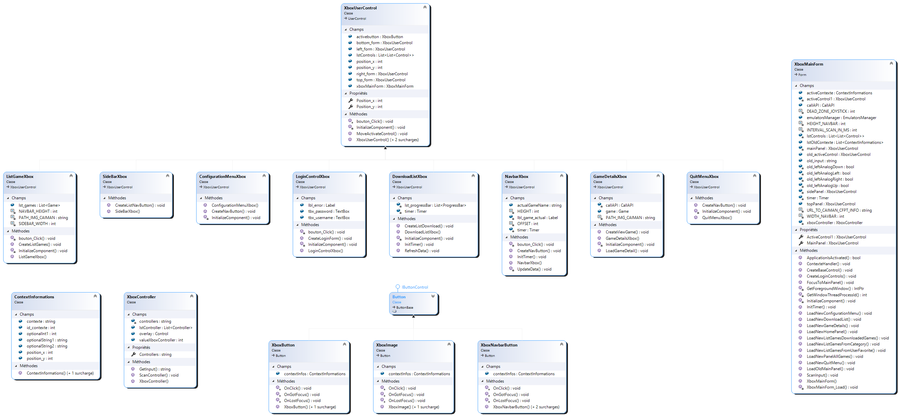

## Description technique: Interface graphique

Diagramme de classe




### Organisation des boutons

Pour faire en sorte de pouvoir se déplacer de bouton en bouton, il m’a fallu trouver une stratégie pour organiser les boutons. Pour structurer la liste des boutons, j’ai finalement décidé de créer une liste de liste de boutons. La liste principale sert de rangé et la “sous liste” sert de colonne. Cela permet de connaître plus aisément l’emplacement des boutons qu’une simple liste à une seule dimension.


### Gestion des inputs


#### Interaction avec les manettes

L’application Caiman prend en charge les manettes reconnues nativement par windows (Xinput). Pour pouvoir communiquer avec la manette, j’ai utilisé le paquet NuGet “SharpDX”, il me permet de connaître les informations et les inputs des manette connectés au pc.

Pour simplifier l’interaction avec la manette de l’utilisateur, j’ai créé une classe “XboxController.cs”, Cette classe me permet de connaître les manettes connectées et de savoir à un instant T les inputs de chaque manette.


#### Transformation d’inputs en événement. 

Pour simplifier la navigation, seule la manette une a le droit de se déplacer dans l’application de Caiman. Pour connaître les inputs, je les rafraîchis toutes les 10ms, cela permet de ne pas avoir de latence ou de louper des inputs. 


#### Gestion des boutons

Quand la fonction ScanInput reçoit un string contenant les inputs de la manette 1. Ce string est envoyé dans un switch qui va faire une comparaison entre l’input précédent de la manette et l’input actuel. Si l’input actuel est différent de l’ancien alors celaveut dire que l’utilisateur a pressé un bouton puis il l'a soit relâché soit fait une autre combinaison de touches.

Le code suivant n'est pas complet!
```C#
public void ScanInput(object sender, EventArgs e)
        {

            // if the user 1 controller is connected
            if (xboxController.lstController[0].IsConnected)
            {
                string input = xboxController.lstController[0].GetState().Gamepad.Buttons.ToString();
                int inputAnalogLeftX = xboxController.lstController[0].GetState().Gamepad.LeftThumbX;
                int inputAnalogLeftY = xboxController.lstController[0].GetState().Gamepad.LeftThumbY;
```

```C#
if (input == "A" && old_input != "A")
                    {
                        SendKeys.Send("{ENTER}");
                    }
```


#### Gestion du joystick gauche

La réception des inputs pour le joystick n’est pas comme pour les boutons, en sachant que les joysticks sont analogiques, je reçois une valeur entre -32000 et +32000. Je vais recevoir ces valeurs pour l’axe X et l’axe Y. Pour savoir si l’utilisateur a poussé le joystick dans une direction, j’ai défini une “deadzone” dans laquelle je considère qu' aucune direction n’est définie par l’utilisateur de la manette. J’ai défini cette zone à 20000, j’ai fait des tests pour savoir où je trouvais que la “deadzone” devait s'arrêter. Puis j’ai fait comme pour les boutons,  j’ai fait une comparaison avec la valeur précédente pour savoir si le joystick vient d'être poussé.

```C#
                bool leftAnalogUp = false;
                bool leftAnalogDown = false;
                bool leftAnalogLeft = false;
                bool leftAnalogRight = false;

                if (inputAnalogLeftX > DEAD_ZONE_JOYSTICK)
                {
                    leftAnalogRight = true;
                }

                if (inputAnalogLeftX < -DEAD_ZONE_JOYSTICK)
                {
                    leftAnalogLeft = true;
                }

                if (inputAnalogLeftY > DEAD_ZONE_JOYSTICK)
                {
                    leftAnalogUp = true;
                }

                if (inputAnalogLeftY < -DEAD_ZONE_JOYSTICK)
                {
                    leftAnalogDown = true;
                }
```


### Découpage de l’interface

 L’interface de l’application Caiman est divisée en trois parties hormis pour la connexion.


#### Navbar

La première est la navbar qui contient les différents boutons de navigation et les informations sur le jeu en cours. Tous les boutons sont créés dynamiquement, le placement s’adapte à l'écran principal de l’utilisateur, mais s’il a un écran vraiment trop petit, les informations sur le jeu en cours et les boutons risquent de s'entremêler.

Pour afficher le jeu en cours, le navigateur est obligé de se rafraîchir et de se redessiner toutes les secondes pour afficher le temps de jeu. Pour savoir si un jeu est en cours,lal'a navbar regarde si le GameTimer est lancé. Si le GameTimer est lancé c’est qu'un jeu est en cours, dans ce cas il va afficher le nom et le temps de jeu.

```C#
private void UpdateData(object sender, EventArgs e)
        {
            if (xboxMainForm.emulatorsManager.gameTimer != null)
            {
                if (actualGameName != "")
                {
                    lbl_game_actual.Text = " Now playing: " + actualGameName + "  " + xboxMainForm.emulatorsManager.gameTimer.ToString();
                }
                else
                {
                    lbl_game_actual.Text = "";
                }
            }
            else
            {
                lbl_game_actual.Text = "";
            }
        }
```


#### Sidebar

La sidebar contient des boutons qui permettent d’afficher différentes listes de jeux. Ces boutons sont en partie créés dynamiquement et en partie reçus de l’API. Les premiers boutons sont ceux qui concernent l’utilisateur, on va les avoir dans l’ordre:


*   Downloaded games
*   Favorites games
*   All games

Ces catégories ne sont pas créées dynamiquement.

Par contre, les suivants sont reçus de l’API, ils concernent les différentes catégories disponibles pour Caiman. À l’appui de ces boutons, la liste des jeux va être chargée et le main panel va afficher la liste des jeux reçus par l’API.

```C#
public void CreateListNavButton()
        {
            List<string> lst_navbar = new List<string>();
            List<Category> lst_category = xboxMainForm.callAPI.CallAllCategories();
            lst_navbar.Add("Downloaded games");
            lst_navbar.Add("Favorites games");
            lst_navbar.Add("All games");

            foreach (var item in lst_category)
            {
                lst_navbar.Add(item.name);
            }
            for (int i = 0; i < lst_navbar.Count; i++)
            {
                lstControls.Add(new List<Control>());
                lstControls[i].Add(new XboxButton());
            }

            //update the buttons infos
            for (int a_row = 0; a_row <= (lst_navbar.Count -1); a_row++)
            {

                List<string> lstString = new List<string>();
                XboxButton tempButton = new XboxButton("side", a_row, a_row, 0);
                lstControls[a_row][0] = tempButton;
                lstControls[a_row][0].Text = lst_navbar[a_row];
                lstControls[a_row][0].Location = new System.Drawing.Point(0 * 100 + 20, a_row * 75 + 15);
                lstControls[a_row][0].Width = 200;
                lstControls[a_row][0].Height = 50;
                lstControls[a_row][0].Name =  "btn_"+ lst_navbar[a_row];


                Controls.Add(lstControls[a_row][0]);
                lstControls[a_row][0].Click += new System.EventHandler(bouton_Click);

            }

            //set the action of button
            XboxButton downloadedGames = (XboxButton)lstControls[0][0];
            downloadedGames.contextInfos.contexte = "downloadedGames";
            XboxButton userFavoritesGames = (XboxButton)lstControls[1][0];
            userFavoritesGames.contextInfos.contexte = "favorite";
            XboxButton allGames = (XboxButton)lstControls[2][0];
            allGames.contextInfos.contexte = "home";

            for (int i = 0; i < lst_category.Count; i++)
            {
                XboxButton tempButton = (XboxButton)lstControls[(i+3)][0];
                tempButton.contextInfos.contexte = "category";
                tempButton.contextInfos.id_contexte = (lst_category[i].id);
            }

        }


    }
```


#### Main panel

Néanmoins,le main panel ne peut pas vraiment être décrit, c’est un panel contextuel qui va être défini par les besoins de l’utilisateur.


### Affichage d’une liste de jeu

Pour l’affichage des listes des jeux, j’ai essayé de faire en sorte que le panel soit le plus flexible possible. le panel demande juste une liste de jeux, il n’y a pas de panel fait pour les jeux favoris ou les jeux déjà présents sur le disque.

Le panel utilise la fonction CreateListGames() pour dessiner les différents boutons de lien vers les détails des jeux. Pour que certaines images ne dépasse pas l’écran et qu’elles soient coupées, la fonction calcul le nombre d’images qu’elle peut afficher par ligne. Le calcul se fait selon la définition de l’écran de l’utilisateur. Les images affichées sont celles qui sont dans le dossier appdata de Caiman.

```C#
public void CreateListGames()
        {

            string imgPath = Path.Combine(Environment.GetFolderPath(Environment.SpecialFolder.ApplicationData), PATH_IMG_CAIMAN);
            XboxImage tempXboxImage = new XboxImage();
            int max_rank = Width / (315);
            int tempPos_x = 0;
            int tempPos_y = 0;
            lstControls.Add(new List<Control>());


            foreach (var game in lst_games)
            {
                if (tempPos_x == max_rank)
                {
                    lstControls.Add(new List<Control>());
                    tempPos_y++;
                    tempPos_x = 0;
                }

                lstControls[tempPos_y].Add(new XboxImage());
                Image img = new Bitmap((imgPath+ game.imageName));
                XboxImage tempButton = new XboxImage("game", img, game.id, tempPos_x, tempPos_y);
                lstControls[tempPos_y][tempPos_x] = tempButton;
                lstControls[tempPos_y][tempPos_x].Location = new System.Drawing.Point(tempPos_x * 300 + 15, tempPos_y * 430 + 15);

                Controls.Add(lstControls[tempPos_y][tempPos_x]);
                tempButton.Click += new System.EventHandler(bouton_Click);


                tempPos_x++;
            }
        }
```


### Gestion des erreurs de déplacement

Le déplacement à la manette se fait par déplacement haut,bas,gauche,droite. Donc, J’ai décidé de faire en sorte que si l’utilisateur se déplace dans une case qui n'existe pas, ils soient soit déplacés dans l’une des casses disponibles proche de la case demandée, autrement  rien ne se passe.

Pour cela, j'ai dû décider arbitrairement ce qui se passait. si un mouvement illégal était fait. J’ai essayé de reproduire les déplacements utilisés dans l’interface de la console Xbox. Il y a certains cas qui ne sont pas forcément bien gérés. Il serait possible de faire un déplacement en calculant la position actuelle et en se basant sur la position en pixel. Cette alternative pourrait être intéressante.

```C#
public void MoveActivateControl(string destination = "")
        {
            //top = 1
            //right = 2
            //down = 3
            //left = 4
            if (destination == "down")
            {
                if (lstControls[position_y][position_x] == null)
                {
                    int x = position_x;
                    int y = position_y;

                    int y_right_not_disponible;
                    while (x < lstControls[position_y].Count() && lstControls[position_y][x] == null)
                    {
                        if (x > lstControls[position_x-1].Count())
                        {
                            break;
                        }
                        x++;
                    }
                    if (x == lstControls[position_y].Count())
                    {
                        y_right_not_disponible = y;

                        while (y_right_not_disponible>0)
                        {
                            y_right_not_disponible --;
                            if (lstControls[y_right_not_disponible][position_x] != null)
                            {
                                position_y = y_right_not_disponible;
                                lstControls[(position_y)][position_x].Focus();
                                return;
                            }
                        }
                    }
                    lstControls[(position_y)][x].Focus();
                    Position_x = x;
                }
                else
                {
                    lstControls[(position_y)][position_x].Focus();
                }
            }
            else
            {
                if (position_x < lstControls[position_y].Count())
                {


                    if (lstControls[position_y][position_x] == null)
                    {
                        int x = position_x - 1;
                        int y = position_y;
                        while (lstControls[position_y][x] == null)
                        {
                            if (x < 0)
                            {

                                break;
                            }
                            x--;
                        }
                        lstControls[(position_y)][x].Focus();
                        Position_x = x;
                    }
                    else
                    {
                        lstControls[(position_y)][position_x].Focus();
                    }
                }
                else {
                    position_y--;
                }
            }
        }
```


### Passage de la souris à la manette

Durant mes tests de l'application, je me suis rendu compte que le fait de passer de la manette à la souris et inversement, posait un problème. Quand je passais de l’un à l'autre la position du curseur n’était pas sauvegardée. Quand je passais de la souris à la manette, le curseur se retrouvait à une position erronée. Pour pouvoir pallier au problème, chaque bouton a une position définie et quand l’utilisateur clique dessus ,un événement se déclenche et notifie la forme que le bouton actuel a changé.

```C#
protected override void OnClick(EventArgs e)
        {
            base.OnClick(e);

            //tell to the topMainForm which control is active
            XboxUserControl xboxUserControl = (XboxUserControl)this.Parent;
            if (xboxUserControl != null)
            {
            xboxUserControl.position_x = this.contextInfos.position_x;
            xboxUserControl.position_y = this.contextInfos.position_y;
            }


            if ((XboxMainForm)this.TopLevelControl != null)
            {
                XboxMainForm topMainForm = (XboxMainForm)this.TopLevelControl;
                topMainForm.ActiveControl1 = xboxUserControl;
            }
        }
```
